# bgbgone

[](https://github.com/Arthur-Ficial/bgbgone)
[](https://swift.org)
[](https://developer.apple.com/macos/)
[](https://developer.apple.com/documentation/vision)
[](LICENSE)

**A UNIX-style background remover for macOS. Image in, image out — Apple Vision masks plus Core Image, zero dependencies, 100% on-device, 100% scriptable.**

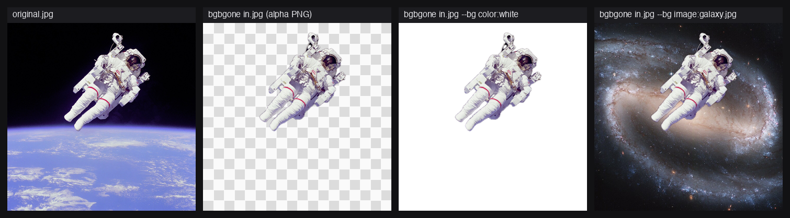

## Contents

- [Install](#install)
- [Quickstart](#quickstart)
- [Inputs](#inputs)
- **Output modes**
  - [Transparent cutout](#transparent-cutout)
  - [Alpha matte](#alpha-matte)
  - [Solid-colour background](#solid-colour-background)
  - [Image background](#image-background)
- **Filter recipes**
  - [Colour-pop](#colour-pop)
  - [Portrait blur](#portrait-blur)
  - [Die-cut sticker](#die-cut-sticker)
  - [Motion-radial backdrop](#motion-radial-backdrop)
  - [Edge feathering](#edge-feathering)
- [Pipelines](#pipelines)
- [Filters](#filters)
- [Server mode](#server-mode)
- [Performance](#performance)
- [Exit codes](#exit-codes)
- [Architecture](#architecture)
- [Development](#development)
- [Attribution](#attribution)
- [License](#license)

## Install

```bash
brew install Arthur-Ficial/tap/bgbgone
```

macOS 26+, ~3 MB binary, no Xcode needed. From source: `make install` writes to `/usr/local/bin`.

## Quickstart

```bash
bgbgone in.jpg -o cutout.png                     # transparent PNG (default)
bgbgone in.jpg --bg color:#1a2233 -o out.jpg     # composite onto a solid colour
cat in.jpg | bgbgone > cutout.png                # stdin in, stdout out
bgbgone in.jpg --out-dir out/                    # batch: bgbgone *.jpg --out-dir out/
```

Every example below is one of these four forms with a `--filter` chain added. Each is also a byte-identical HTTP request — see [Server mode](#server-mode).

## Inputs

Three originals drive every example below. Each is shown once here; later sections reuse the same fixtures.

| `red-panda.jpg` | `corgi-puppy.jpg` | `woman-singer.jpg` |
|---|---|---|
|  | 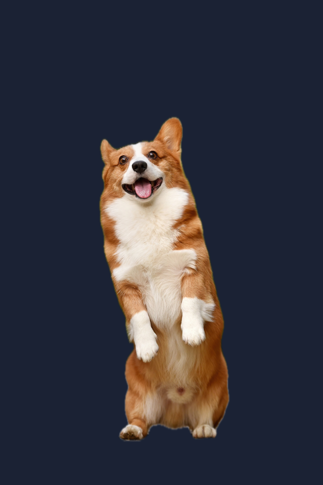 |  |

## Transparent cutout

The default: remove the background, emit a PNG with alpha. The checkerboard shows transparency.

```bash
bgbgone red-panda.jpg -o red-panda-cutout.png
```

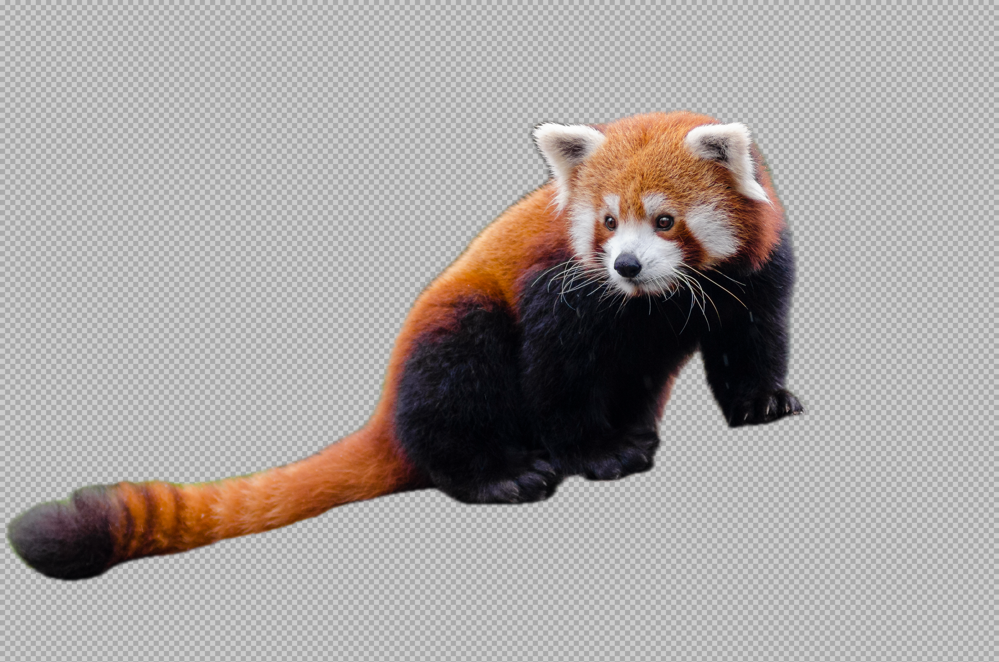

## Alpha matte

`--channels alpha` emits the mask itself as a grayscale silhouette — the matte for downstream compositing.

```bash
bgbgone red-panda.jpg --channels alpha -o red-panda-matte.png
```

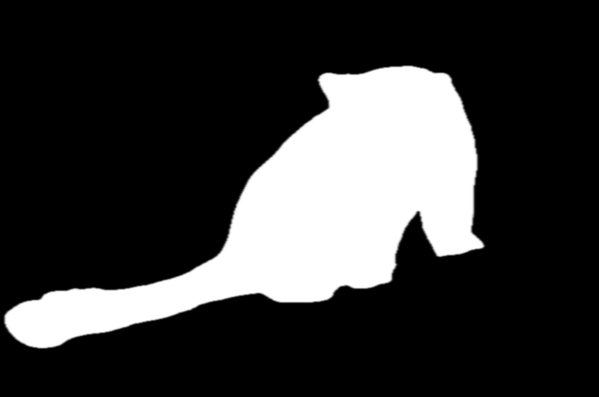

## Solid-colour background

Composite the cutout onto a flat colour. JPEG output works because alpha is flattened away.

```bash
bgbgone red-panda.jpg --bg color:#1a2233 -o red-panda-on-navy.jpg
```

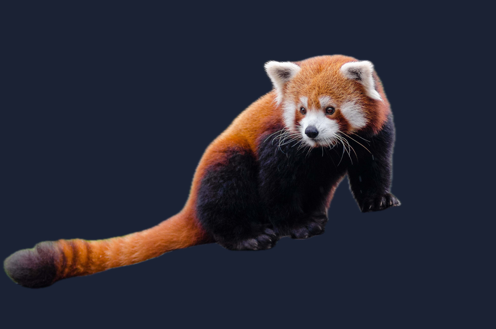

## Image background

Any image works as the background. Here, the [Flaming Star Nebula (Chuck Ayoub, CC0)](Tests/fixtures/nebula-flaming-star.png).

```bash
bgbgone red-panda.jpg --bg "image:nebula-flaming-star.png" -o red-panda-in-space.jpg
```

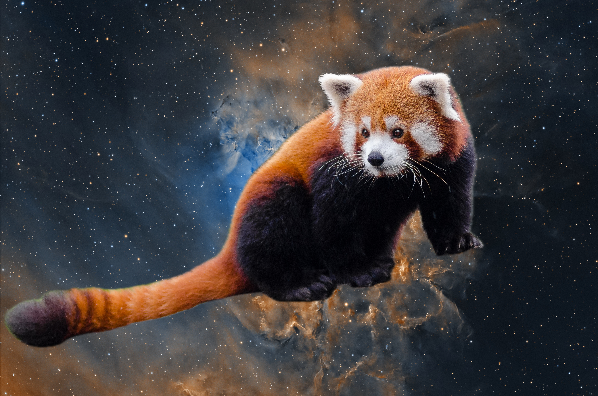

## Colour-pop

Background goes black-and-white, the subject keeps its colour — `bg:grayscale` over the photo's own background.

```bash
bgbgone red-panda.jpg --bg "image:red-panda.jpg" --filter "bg:grayscale" -o red-panda-colourpop.jpg
```

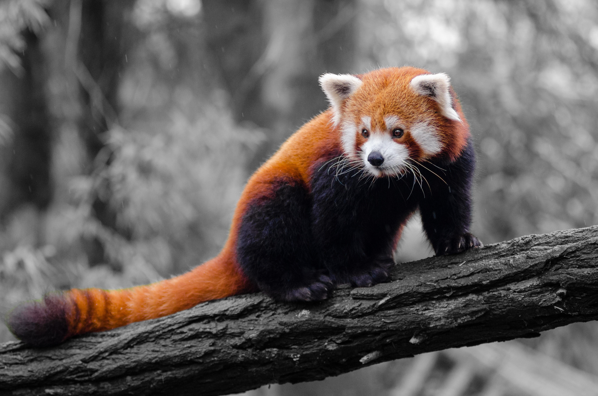

## Portrait blur

Silky background blur, subject razor-sharp — `bg:blur=60`.

```bash
bgbgone red-panda.jpg --bg "image:red-panda.jpg" --filter "bg:blur=60" -o red-panda-portrait.jpg
```

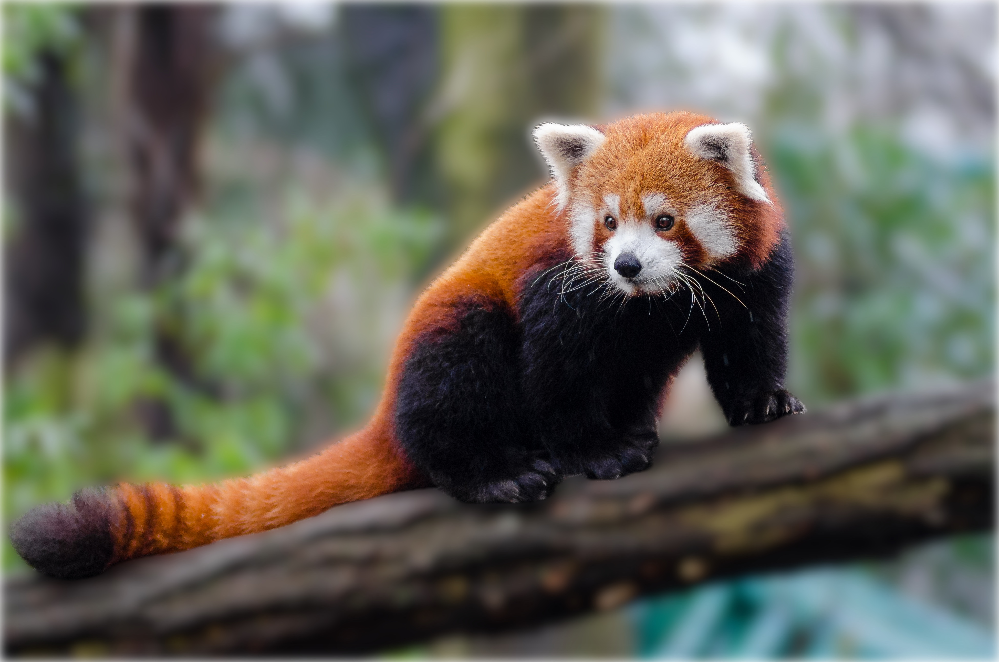

## Die-cut sticker

Crop to the subject, then add a hard white outline on the transparent cutout. Two steps: outlining the raw photo would leave the original background showing outside the border.

```bash
bgbgone corgi-puppy.jpg --crop --crop-margin "8%" -o corgi-cutout.png
bgbgone corgi-cutout.png --filter "fg:outline=color=#fff:width=30" -o corgi-sticker.png
```

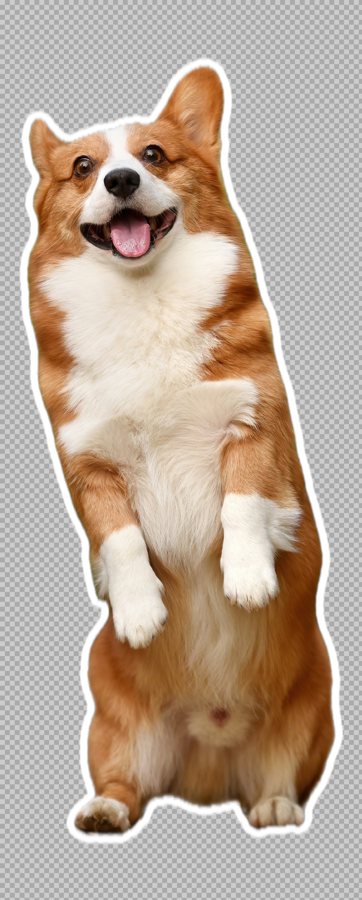

## Motion-radial backdrop

Radial zoom-blur behind a person — `--type person` selects the human-segmentation model.

```bash
bgbgone woman-singer.jpg --type person \
  --bg "image:woman-singer.jpg" \
  --filter "bg:zoom-blur=center=0.5,0.45:amount=60" \
  -o woman-singer-zoom-blur.jpg
```


## Edge feathering

`mask:feather=N` softens the matte edge by N pixels. The close-up shows three values on one fixture: default hard edge, `feather=24` (soft glow), and `feather=80` (extreme halo).

```bash
bgbgone corgi-puppy.jpg                                -o corgi-f0.png   # razor edge
bgbgone corgi-puppy.jpg --filter "mask:feather=24"     -o corgi-f24.png  # soft glow
bgbgone corgi-puppy.jpg --filter "mask:feather=80"     -o corgi-f80.png  # extreme
```

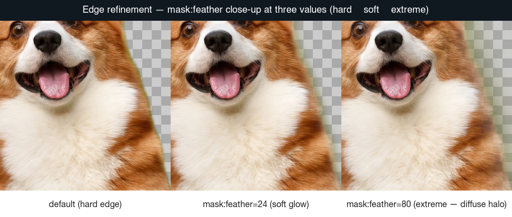

## Pipelines

Image in, image out — compose with sibling Apple-framework CLIs over stdin/stdout.

```bash
bgbgone red-panda.jpg -o red-panda-cutout.png && auge --classify red-panda-cutout.png
```

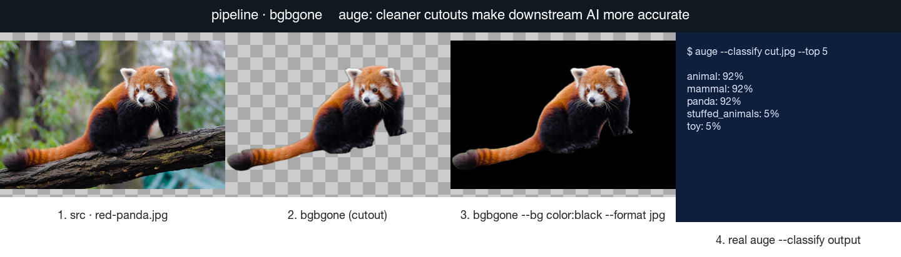

## Filters

49 Core Image filters, layered onto `bg` / `fg` / `all` / `mask` / `composite`.

```text
--filter "<layer>:<name>[=args][,<name>...]; <layer>:..."
```

- **Catalogue (49 filters):** [`docs/filters/README.md`](docs/filters/README.md) — grouped by layer set, each row links to a per-filter doc with a paired before/after image.
- **Machine-readable:** `bgbgone --filters-list --json` — stable array with `name`, `layers`, `signature`, `doc`, `producesAlpha`, `positional`, `keyed`, `examples`.
- **Per-filter help:** `bgbgone --help filter=<name>`.

## Server mode

`bgbgone --server` exposes the same `Config` and pipeline over local HTTP. Every flag has an HTTP twin with byte-identical output, verified in [`Tests/integration/run-server-parity.sh`](Tests/integration/run-server-parity.sh) (19 cases, all green).

```bash
bgbgone --server --host 127.0.0.1 --port 8787 &
curl -X POST http://127.0.0.1:8787/bgbgone \
  -F "image_file=@red-panda.jpg" \
  -F "format=jpg" \
  -F "bg=@red-panda.jpg" \
  -F "filter=bg:grayscale" \
  -o red-panda-colourpop.jpg
```


Full walkthrough (every example mirrored as curl): [`SERVER-README.md`](SERVER-README.md). Wire contract: [`docs/server/README.md`](docs/server/README.md). Security: [`docs/server/security.md`](docs/server/security.md).

## Performance

On-device, no network, single process per batch. Inputs are strict-PD Wikimedia fixtures (JPG, 95 KB–665 KB) cycled into batches; output bytes are verified identical across every invocation, so timings reflect real work — not caching.

<!-- LOAD-TEST-TABLE-START -->
| Images | Total time | Per image | Throughput |
|-------:|-----------:|----------:|-----------:|
| 100 | 2.75 s | 27.5 ms | 36.30 img/s |
| 1 000 | 28.82 s | 28.8 ms | 34.69 img/s |
| 10 000 | 4 min 54 s | 29.4 ms | 34.01 img/s |
<!-- LOAD-TEST-TABLE-END -->

Reproduce: `make load-test-table`, or per scale `make perf-100` / `make perf-1000` / `make perf-10000`.

## Exit codes

| code | meaning |
|------|---------|
| `0` | success |
| `1` | user error (bad input, refusing TTY) |
| `2` | parser error / no foreground subject found |
| `3` | framework error (Vision unavailable) |

## Architecture

`CLI args` → `ConfigParser` (pure Swift) → `BgBgOne` pipeline → `Algorithms/` (Vision: vn-mask / person / saliency) + `FilterPipeline` (49 Core Image filters) + `Compositor` (mask + bg) → `Output` (PNG / JPG / HEIC / AVIF / TIFF / ZIP). `NetworkGuard` hard-blocks all sockets at runtime. CLI and `--server` resolve to the same `Config` and run the same pipeline. Details: [docs/design.md](docs/design.md).

## Development

Working agreement: [DEVELOPMENT.md](DEVELOPMENT.md). Per-AI-session rules: [CLAUDE.md](CLAUDE.md).

- `make test` — every lint + unit + integration + doc-block harness
- `make install` — bump patch + build release + install to `/usr/local/bin`
- `make release` — full release gate; regenerates every shipped image asset
- `make deploy` — release + tag + push + GitHub release + Homebrew tap bump

Every fenced bash block in this README and under `docs/` is executed against the installed binary on every `make test` (`scripts/test-doc-blocks.sh`). Every image link is checked (`scripts/lint-doc-images.sh`), and every visual-demo block must be paired with an image (`scripts/lint-block-pairing.sh`).

## Attribution

All 26 test fixtures are public-domain or CC0, plus one CC BY 4.0 own-work portrait. One row per file in [Tests/fixtures/LICENSES.md](Tests/fixtures/LICENSES.md), enforced 1:1 by [`scripts/lint-fixtures.sh`](scripts/lint-fixtures.sh).

## License

MIT. See [LICENSE](LICENSE).

## Made by

A project by **[Franz Enzenhofer](https://github.com/franzenzenhofer)** ([Full Stack Optimization](https://www.fullstackoptimization.com)), built by his AI assistant **[Arthur Ficial](https://github.com/Arthur-Ficial)**.
