# bgbgone

[](https://github.com/Arthur-Ficial/bgbgone)
[](https://bgbgone.franzai.com/)
[](https://swift.org)
[](https://developer.apple.com/macos/)
[](LICENSE)
[](https://developer.apple.com/documentation/vision)
[](#why)

**Official site: [bgbgone.franzai.com](https://bgbgone.franzai.com/)**

## Background, be gone!

One shell command. Any image. Transparent cutout in 86 milliseconds. 100% on your Mac. 100% scriptable. Others sell this as a subscription, but free and open source is just cooler. A 3 MB binary you `brew install` once and own forever.


## Install

```bash
brew tap Arthur-Ficial/tap
brew install Arthur-Ficial/tap/bgbgone
```

Or from source: `make install` (builds release, installs to `/usr/local/bin`). Requires macOS 26+ and Command Line Tools. **No Xcode needed. Zero dependencies. ~3 MB binary.**

```bash
bgbgone in.jpg                                    # creates in_bgbgone.png
bgbgone in.jpg > out.png                          # transparent PNG cutout
bgbgone in.jpg --bg color:white -o on-white.png   # on a colour
bgbgone in.jpg --bg image:beach.jpg -o beach.png  # on an image
cat in.png | bgbgone > out.png                    # pipe
bgbgone *.jpg --out-dir ./out/                    # batch
bgbgone --server                                  # local HTTP API
```

## Why

Every Mac in 2026 ships with a small render farm of on-device image AI. Apple's [Vision framework](https://developer.apple.com/documentation/vision) exposes `VNGenerateForegroundInstanceMaskRequest`, a foundation-model-class background remover, free, on every Mac, offline. But it is only reachable from Swift. `bgbgone` wraps it as a UNIX CLI so you can use it the way you already use `sips`, `imagemagick`, or `ffmpeg`: from shell scripts, build steps, batch jobs, makefiles, and pipelines.

It works on anything with a foreground subject: photographs, paintings, spacecraft imagery, woodblock prints, vintage product advertisements. One flag, sixteen subjects, no per-image tuning:

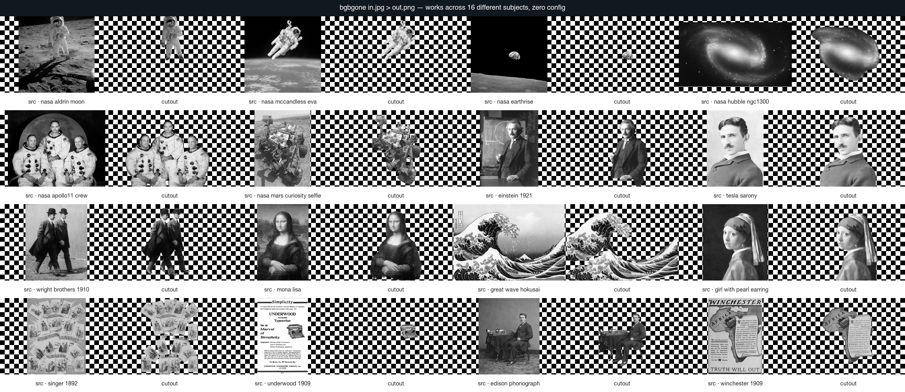

## Quick start

```bash
bgbgone photo.jpg                                           # creates photo_bgbgone.png
bgbgone photo.jpg > cutout.png                              # to stdout
bgbgone photo.jpg -o cutout.png                             # to a file
bgbgone photo.jpg -o cutout.jpg                             # JPEG, white bg by default
bgbgone ~/photos/*.heic --out-dir ./cutouts                 # batch a folder
curl -L https://example.com/photo.jpg | bgbgone > out.png   # pipe in
cat photo.jpg | bgbgone --bg color:white > on-white.png     # pipe through
```

When stdout is a terminal and the input is a file, bgbgone writes `<stem>_bgbgone.<ext>` next to the input instead of dumping binary into the terminal. When stdout is redirected, bgbgone writes image bytes to stdout. For portable scripts, prefer `-o cutout.jpg` over `> cutout.jpg`.

---

## Examples

Every image below is produced by `bash scripts/make-readme-examples.sh` from real bgbgone invocations against the documented [strict-PD Wikimedia fixtures](Tests/fixtures/LICENSES.md). The script is the audit trail.

### Solid colour backgrounds

```bash
bgbgone in.jpg --bg color:white       -o out.png   # named
bgbgone in.jpg --bg color:black       -o out.png
bgbgone in.jpg --bg color:#0066cc     -o out.png   # hex
bgbgone in.jpg --bg color:rgb:0,200,0 -o out.png   # rgb triple
```

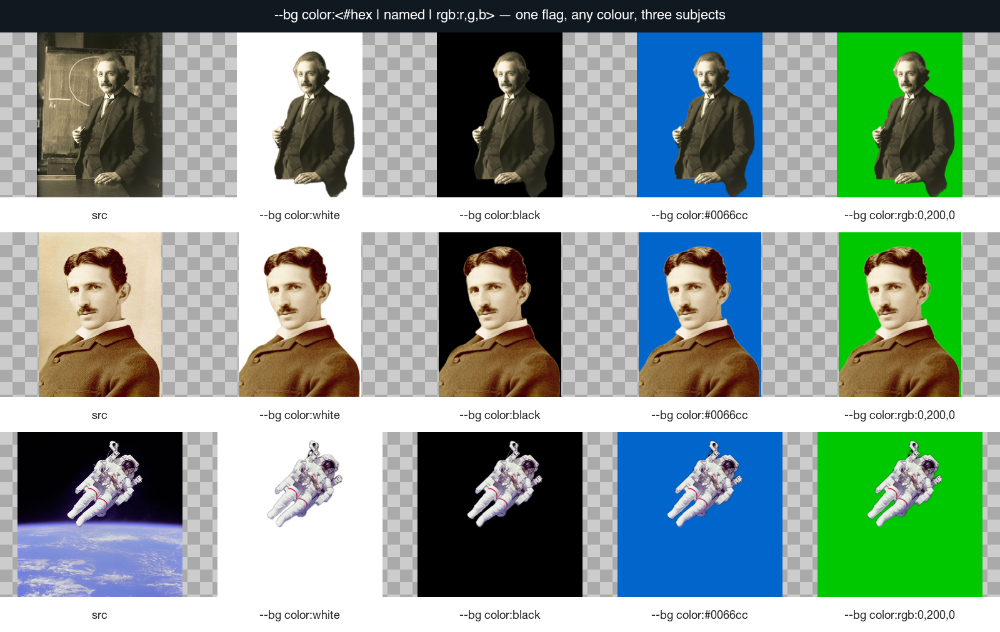

### Image backgrounds

```bash
bgbgone in.jpg --bg image:./bg.jpg                   -o out.png
bgbgone in.jpg --bg image:./bg.jpg --bg-fit cover    -o out.png   # default
bgbgone in.jpg --bg image:./bg.jpg --bg-fit contain  -o out.png
bgbgone in.jpg --bg image:./bg.jpg --bg-fit tile     -o out.png
bgbgone in.jpg --bg image:./bg.jpg --bg-fit center   -o out.png
```

Row 1: same subject, every `--bg-fit` mode. Row 2: same subject on two different PD backgrounds.

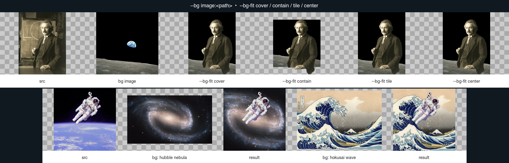

The same Mona Lisa onto six different public-domain backgrounds, one invocation each:

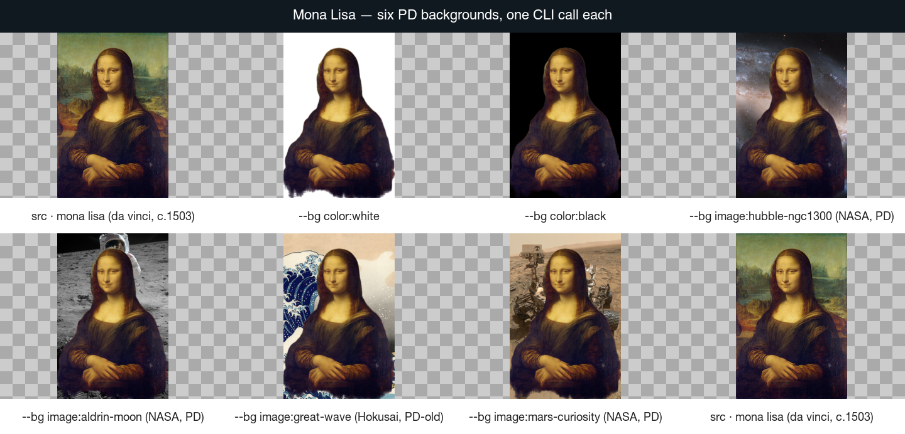

```bash
bgbgone mona-lisa.jpg --bg color:white                       -o studio.jpg
bgbgone mona-lisa.jpg --bg color:black                       -o dark.jpg
bgbgone mona-lisa.jpg --bg image:./hubble-ngc1300.jpg        -o galaxy.jpg
bgbgone mona-lisa.jpg --bg image:./nasa-aldrin-moon.jpg      -o moon.jpg
bgbgone mona-lisa.jpg --bg image:./hokusai-great-wave.jpg    -o wave.jpg
bgbgone mona-lisa.jpg --bg image:./mars-curiosity.jpg        -o mars.jpg
```

### Edge refinement (via `--filter`)

Mask shape and edge softness are tuned via the `--filter` chain — one surface, one grammar, no special-purpose flags. `--crop` tight-crops to the subject's bounding box, `--crop-margin` adds breathing room (uniform single value or per-edge), `--roi` limits detection to a region of interest, `--shadow-type drop` adds a drop shadow under the cutout, and `--semitransparency false` hardens the matte so soft edges become opaque.

```bash
bgbgone in.jpg --bg color:white --filter "mask:feather=8"      -o soft.png
bgbgone in.jpg --filter "mask:threshold=0.55"                  -o crisper.png
bgbgone in.jpg --crop                                          -o tight.png
bgbgone in.jpg --crop --crop-margin 10%                        -o tight-padded.png
bgbgone in.jpg --crop --crop-margin "5% 10%"                   -o api-padded.png
bgbgone in.jpg --crop --crop-margin "5% 10% 15% 20%"           -o four-sided.png
bgbgone in.jpg --roi "0% 0% 100% 80%"                          -o top-region.png
bgbgone in.jpg --filter "fg:scale=0.75"                        -o scaled.png
bgbgone in.jpg --filter "fg:scale=0.5,translate=-200,200"      -o lower-left.png
bgbgone in.jpg --bg color:white --shadow-type drop             -o dropshadow.png
bgbgone in.jpg --shadow-type drop --shadow-opacity 25          -o soft-shadow.png
bgbgone in.jpg --shadow-type none                              -o no-shadow.png
bgbgone in.jpg --semitransparency false                        -o hard-edge.png
bgbgone in.jpg --filter "fg:matte"                             -o matte.png
bgbgone in.jpg --filter "mask:expand=6"                        -o thicker-mask.png
bgbgone in.jpg --filter "mask:contract=6"                      -o thinner-mask.png
```

See [`docs/filters/`](docs/filters/) for the full per-filter deep-dives, and the [Filter showcase](#filter-showcase----filter-chain-in-action) section below for five end-to-end before/after examples.

Feather progression (matte edge softness, `--filter "mask:feather=<N>"`) from hard razor edge to obvious halo:

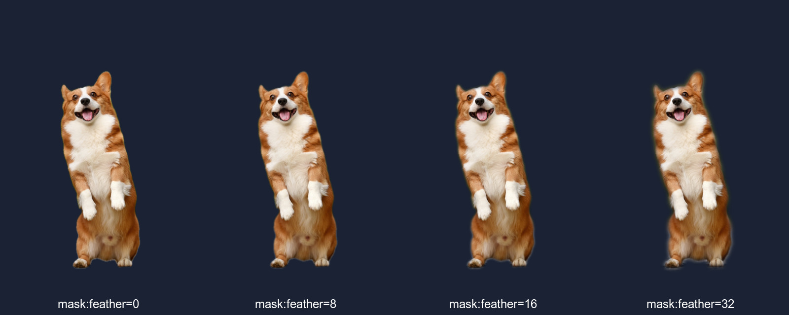

Pixel-level close-up of the corgi's ear at `mask:feather=0` (hard edge) vs `mask:feather=16` (soft matte) — same crop, side-by-side:

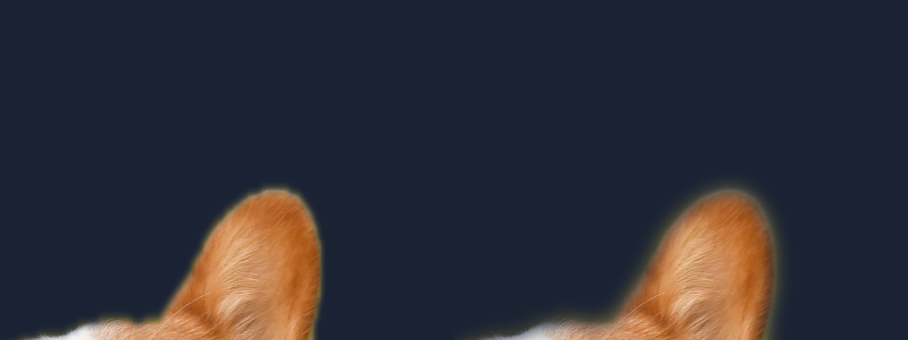

### Algorithm selection (`--type`)

`--type` is the single canonical algorithm selector — same name and same vocabulary as the server's `type` field. It accepts subject hints (`person`, `product`, `car`, `animal`, `graphic`, `transportation`) and direct Vision algorithm names (`auto`, `vn-mask`, `person`, `saliency`):

```bash
bgbgone in.jpg --type auto             # default: VNGenerateForegroundInstanceMaskRequest
bgbgone in.jpg --type vn-mask          # same Vision request, named explicitly (macOS 14+)
bgbgone in.jpg --type person           # VNGeneratePersonSegmentationRequest (macOS 12+)
bgbgone in.jpg --type saliency         # VNGenerateObjectnessBasedSaliencyImageRequest

bgbgone portrait.jpg     --type person          -o cutout.png
bgbgone bottle.jpg       --type product         -o cutout.png
bgbgone sedan.jpg        --type car             -o cutout.png
bgbgone elephant.jpg     --type animal          -o cutout.png
bgbgone logo.png         --type graphic         -o cutout.png
bgbgone bicycle.jpg      --type transportation  -o cutout.png
```

Three subjects with every supported algorithm side by side: a Mars rover, two figures in a meadow, and a painted Renaissance figure.

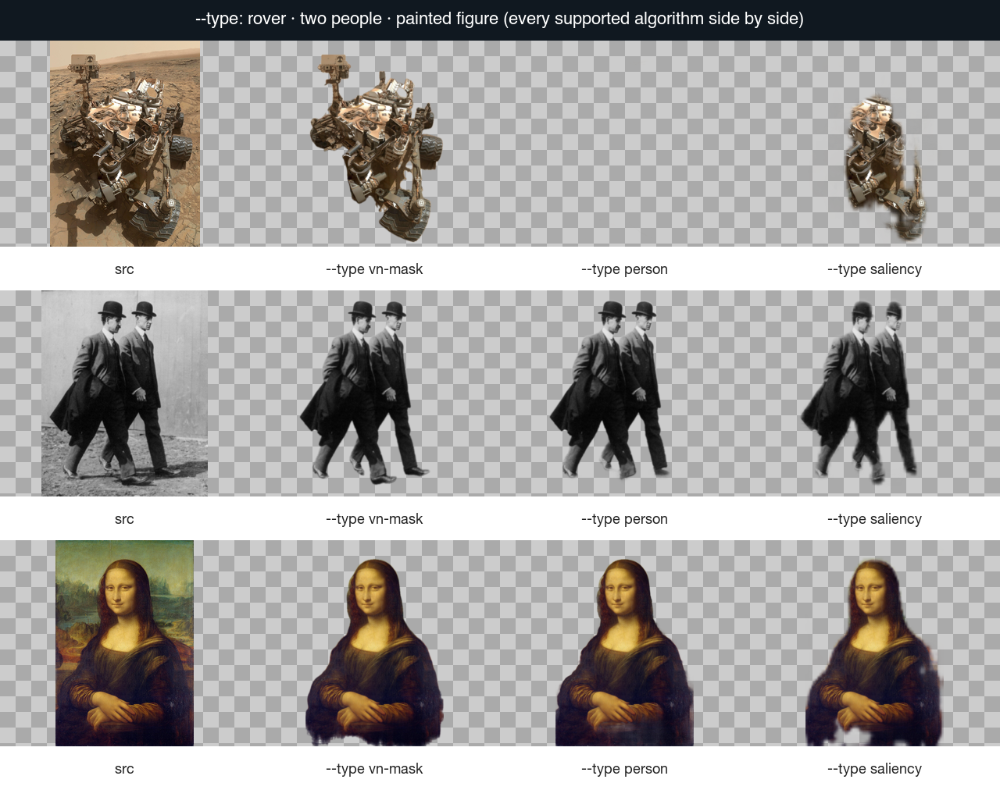

### Output formats

```bash
bgbgone in.jpg --format png                              # transparent PNG (default)
bgbgone in.jpg --format jpg --quality 92                 # white bg unless --bg is set
bgbgone in.jpg --format zip                              # color.jpg + alpha.png package
bgbgone in.jpg -o out.jpg                            # extension infers JPEG
bgbgone in.jpg -o out.heic                           # extension infers HEIC
bgbgone in.jpg --format heic
bgbgone in.jpg --format avif
bgbgone in.jpg --format tiff
bgbgone in.jpg -o - > out.png                        # explicit stdout destination
```

### Output size cap

`--size` caps the output by megapixels so a 12 MP source can land on the web in one call. PNG outputs are additionally clamped to 10 MP (alpha cost) just like the local API.

```bash
bgbgone giant.jpg --size preview --format jpg -o thumb.jpg    # 0.25 MP cap
bgbgone giant.jpg --size full                  -o full.png   # 25 MP cap (10 MP for PNG)
bgbgone giant.jpg --size 50MP --format jpg          -o huge.jpg   # 50 MP cap
bgbgone giant.jpg --size auto  --format jpg         -o auto.jpg   # same cap as full
```

### Multi-instance

```bash
bgbgone team.jpg --multi --out-dir ./people/
# people/team-1.png, people/team-2.png, ...

bgbgone team.jpg --multi --instance-naming "subject_{n:02}.{ext}" --out-dir ./people/
# people/subject_01.png, people/subject_02.png, ...
```

The number of instances is decided by Vision. For tightly-grouped or touching subjects (e.g. an Apollo crew shoulder-to-shoulder) Vision returns one combined instance. For subjects with visible spatial gaps you get one file per subject.

`--multi` is file-output only: it needs a file input stem for naming and cannot read image data from stdin. If `--out-dir` is omitted, files are written beside the input image.

### Structured output

```bash
bgbgone in.jpg --json -o out.png
```

```json
{"ok":true,"schema":"bgbgone.run.v1","result":{"input":"in.jpg","output":"out.png","algo":"vn-mask","format":"png","width":1280,"height":960,"filters":[]}}
```

Errors share the envelope: `{"ok":false,"schema":"bgbgone.run.v1","error":{"code":"BGBG_…","message":"…","where":"…","hint":"…"}}`. CLI `--json`, CLI `--ndjson`, and HTTP `/bgbgone` all use the same shape — one parser for downstream tools.

NDJSON streams through `jq`:

```bash
ls *.jpg | xargs -I{} bgbgone {} --ndjson --out-dir ./out/ \
  | jq -s '.[] | select(.ok) | .result | group_by(.algo) | map({algo: .[0].algo, n: length})'
```

### Local HTTP API

When pipes aren't an option (browser apps, drag-and-drop demos, Postman collections), run the same pipeline behind a local HTTP server. It's still 100% on-device — `NetworkGuard` hard-blocks outbound traffic inside the process.

```bash
bgbgone --server                                              # 127.0.0.1:8787
bgbgone --server --port 9000                                  # custom port
bgbgone --server --token "$(openssl rand -hex 16)"            # require Bearer / X-API-Key
bgbgone --server --token-auto                                 # print one-shot token on startup
bgbgone --server --cors --allowed-origins http://localhost:3000  # CORS for a trusted SPA
bgbgone --server --host 0.0.0.0 --token-auto --public-health  # LAN-exposed, /health stays public
bgbgone --server --max-body-mb 64                             # raise body limit (default 32 MiB)
bgbgone --server --no-origin-check                            # disable browser origin filtering
bgbgone --server --footgun                                    # wildcard CORS + no origin check (demos only)
```

Endpoints:

```bash
curl http://127.0.0.1:8787/health                                # liveness JSON

curl -X POST http://127.0.0.1:8787/bgbgone \
    -F image_file=@photo.jpg -F format=png -o cutout.png         # multipart, PNG

curl -X POST http://127.0.0.1:8787/bgbgone \
    -F image_file=@photo.jpg -F format=jpg -F bg=color:#ffffff \
    -o on-white.jpg                                              # JPEG on white

curl -X POST http://127.0.0.1:8787/bgbgone \
    -F image_file=@photo.jpg -F channels=alpha -o matte.png      # mask-only

curl -X POST http://127.0.0.1:8787/bgbgone \
    -F image_file=@photo.jpg -F format=zip -o result.zip         # color.jpg + alpha.png

curl -X POST http://127.0.0.1:8787/bgbgone \
    -H "Accept: application/json" \
    -F image_file=@photo.jpg                                     # JSON-wrapped base64 PNG

curl -X POST http://127.0.0.1:8787/bgbgone \
    -H "Authorization: Bearer $TOKEN" \
    -F image_file=@photo.jpg -F type=person -F type-level=2 \
    -o portrait.png                                              # token auth + subject hint

curl -X POST http://127.0.0.1:8787/bgbgone \
    -H "Content-Type: application/json" \
    -d '{"image_file":"<base64>","format":"jpg","bg":"color:#0066cc","filter":"fg:scale=0.6,translate=25,75"}'
```

Successful image responses include `X-Width`, `X-Height`, `X-Credits-Charged: 0`, `X-Foreground-Top`, `X-Foreground-Left`, `X-Foreground-Width`, `X-Foreground-Height`, and (unless `type-level=none`) `X-Type`. Unknown fields are rejected with HTTP `400`. Full wire contract and security matrix in [`docs/server/`](docs/server/).

### Pipe into downstream AI

A clean cutout makes downstream classifiers, embedders, and OCR more accurate. With [auge](https://github.com/Arthur-Ficial/auge):


```bash
bgbgone Tests/fixtures/06-nasa-mars-curiosity-selfie.jpg \
    --bg color:black --format jpg -o /tmp/cut.jpg
auge --classify /tmp/cut.jpg --top 5
# machine: 52%
# toy: 12%
# figurine: 12%
# art: 10%
# statue: 10%
```

### Product photography: every step

For each vintage product fixture: source, then `--filter "fg:matte"` matte, then transparent cutout, then composed onto a PD background. Same four-step pipeline, four different products.

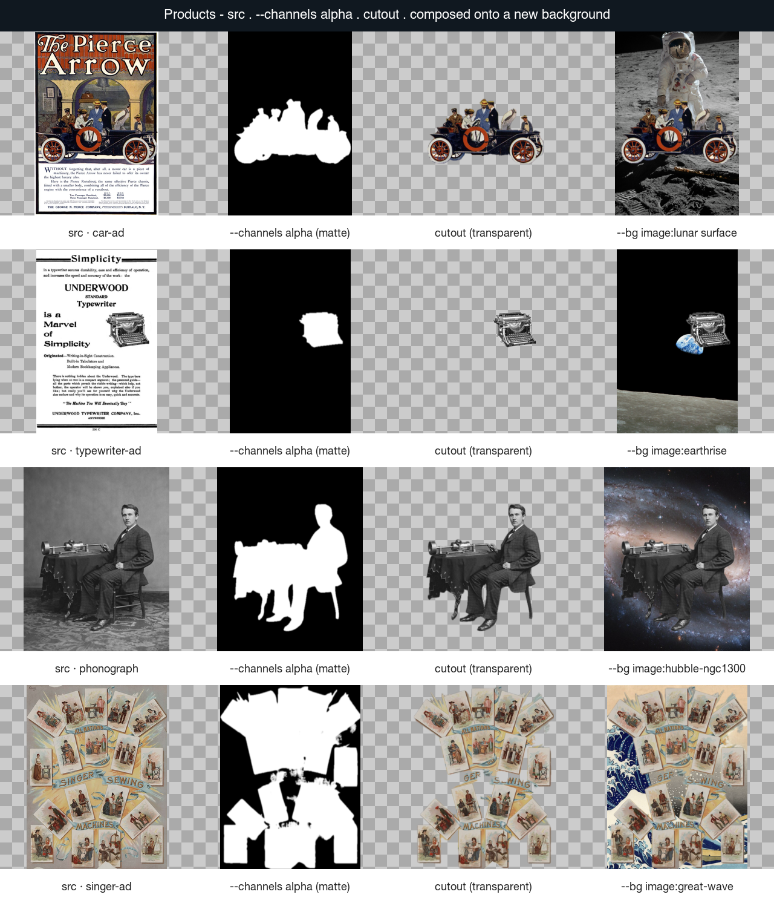

```bash
bgbgone pierce-arrow-1909.jpg --filter "fg:matte"                  -o matte.png
bgbgone pierce-arrow-1909.jpg                                      -o cutout.png
bgbgone pierce-arrow-1909.jpg --bg image:nasa-aldrin-moon.jpg      -o on-moon.png
```

Swap the new-background line for `--bg color:white` and you have a white-bg product-catalogue pipeline.

---

## Recipes

Catalogue an entire photo library on a white background:

```bash
for f in ~/products/*.heic; do
    bgbgone "$f" --bg color:white --format jpg --quality 92 \
        --out-dir ~/catalogue/ --json
done | jq -s 'group_by(.algo) | map({algo: .[0].algo, count: length})'
```

Brand-coloured profile picture, tight-cropped, soft edge, high-quality JPEG:

```bash
bgbgone selfie.jpg --bg color:#0066cc --crop --filter "mask:feather=2" \
    --format jpg --quality 95 -o linkedin-avatar.jpg
```

Sticker pack from a group photo (one PNG per detected instance):

```bash
bgbgone team-portrait.jpg --multi \
    --instance-naming "{base}-sticker-{n:02}.{ext}" \
    --out-dir ./stickers/
```

Doc-site product shot:

```bash
bgbgone product.heic --bg color:white --crop --filter "mask:feather=1" \
    --format jpg --quality 92 -o ./docs/product-shot.jpg
```

Chain with sibling tools. Remove the background, then classify or embed the cleaner cutout:

```bash
bgbgone photo.jpg --bg color:black --format jpg -o /tmp/x.jpg && auge --classify /tmp/x.jpg
bgbgone photo.jpg --bg color:black --format jpg -o /tmp/x.jpg && kern --embed-image /tmp/x.jpg
```

Run a token-protected local server for a browser SPA on `localhost:3000`:

```bash
TOKEN="$(openssl rand -hex 16)"
bgbgone --server --token "$TOKEN" --cors --allowed-origins http://localhost:3000 &
# in the SPA:
fetch("http://127.0.0.1:8787/bgbgone", {
    method: "POST",
    headers: { Authorization: "Bearer " + token },
    body: formData
});
```

Drop a "remove background" hot folder onto your Mac with a one-liner watcher:

```bash
fswatch -0 ~/Drop | while IFS= read -r -d '' f; do
    bgbgone "$f" --bg color:white --format jpg --quality 92 \
        --out-dir ~/Drop/out/ --json --quiet
done
```

bgbgone is part of the [apfel](https://github.com/Arthur-Ficial/apfel) ecosystem of on-device CLI tools:

| Tool                                              | Capability                  | Apple framework        |
| ------------------------------------------------- | --------------------------- | ---------------------- |
| [apfel](https://github.com/Arthur-Ficial/apfel)   | LLM (text generation)       | FoundationModels       |
| [auge](https://github.com/Arthur-Ficial/auge)     | Vision / OCR (see)          | Vision                 |
| **bgbgone** (this)                                | Background removal (do)     | Vision + Core Image    |
| [ohr](https://github.com/Arthur-Ficial/ohr)       | Speech-to-text              | SpeechAnalyzer         |
| [kern](https://github.com/Arthur-Ficial/kern)     | Embeddings                  | NLContextualEmbedding  |

## Filter showcase — `--filter` chain in action

bgbgone v1.0.0 ships a 49-filter chain. Apple Vision separates foreground from background; per-layer filters then transform either independently, all together, or the mask itself. Five end-to-end examples below, each regenerated against the strict-CC0 fixtures in [`Tests/fixtures/showcase/`](Tests/fixtures/showcase/) via [`scripts/make-filter-showcase.sh`](scripts/make-filter-showcase.sh).

Run `bgbgone --filters-list` to enumerate every filter with its valid layers, signature, and one-line doc. Per-filter deep-dives live in [`docs/filters/`](docs/filters/).

### 1. Colour-pop — original background goes B&W, subject keeps its colour

```bash
bgbgone red-panda.jpg --filter "bg:grayscale" -o colourpop.jpg
```

| Before (original photo) | After (colour-pop) |
|---|---|
|  |  |

When the filter chain uses the `bg` layer but no `--bg image:...` is set, bgbgone auto-promotes the source photo as the background plate. The pipeline extracts the subject via Apple Vision, runs `bg:grayscale` (CIColorControls with saturation 0) on the background plate only, then composites the colour subject back on top. Subject stays vibrantly red-orange; the forest behind goes monochrome. The explicit form `--bg image:red-panda.jpg --filter "bg:grayscale"` produces the same output.

### 2. Portrait mode — silky background blur, sharp subject

```bash
bgbgone red-panda.jpg --filter "bg:blur=60" -o portrait.jpg
```

| Before (original photo) | After (portrait mode) |
|---|---|
|  |  |

`CIGaussianBlur` at radius 60 runs on the background plate only; the foreground stays pin-sharp. Note: no `--bg` flag needed — when a chain uses the `bg` layer, bgbgone auto-promotes the source image as the background plate. Phone-camera portrait mode in one shell command.

### 3. Sticker style — die-cut white border + drop shadow

**Sticker spec.** A real die-cut sticker has a HARD opaque edge — no soft halo, no semi-transparent gradient, no green photo-background bleed-through between subject and border. The border is solid white. The drop shadow lives entirely behind the sticker. The way bgbgone achieves that without bleed is to let the `outline` filter dilate the matte internally and fill the ring with the chosen colour, instead of dilating the mask upstream with `mask:expand` (which would pull the original photo's edge pixels into the ring):

```bash
bgbgone corgi.jpg --bg color:#1a2233 \
  --filter "fg:shadow=blur=40:offset=22,22:opacity=0.7:color=#000,outline=color=#fff:width=30" \
  -o corgi-sticker.jpg
```

| Before (original photo) | After (sticker) |
|---|---|
|  | 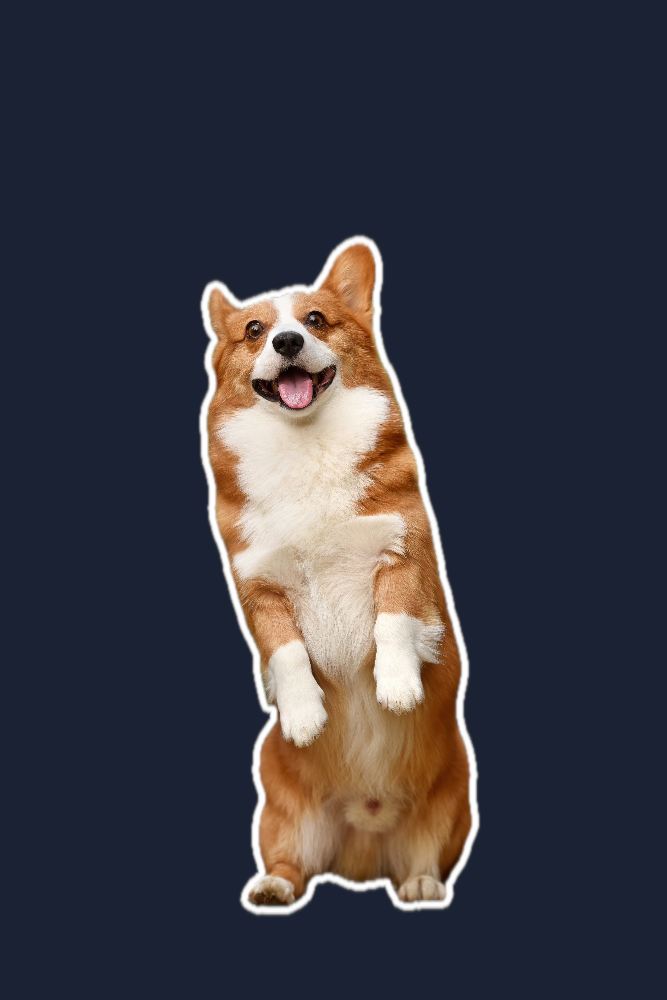 |

Single-stage `fg:` chain on a sharp matte. `shadow=blur=40:offset=22,22:opacity=0.7` lays a soft drop shadow under the cut-out silhouette; `outline=color=#fff:width=30` dilates the matte internally and fills the 30-px ring with solid white — the white reaches the navy plate directly, no halo. The dark navy plate (`--bg color:#1a2233`) makes both the solid white border and the shadow clearly visible.

If you instead want rounded sticker corners that ignore subject detail (e.g. ear tips), use `mask:expand=N,feather=M,threshold=0.5` BEFORE the `fg:` stage — `mask:threshold` re-binarises the feathered matte so the rounded contour still ends in a hard alpha edge and there is no soft halo.

### 4. Vintage backdrop, modern subject — fg/bg colour split (Parastoo in a library)

```bash
bgbgone parastoo.jpg --type person \
  --filter "bg:sepia=1.0,adjust=brightness=-0.15:saturation=0.45; composite:vignette=1.8:1.1" \
  -o vintage.jpg
```

| Before (original photo) | After (vintage backdrop) |
|---|---|
|  |  |

`--type person` uses Apple Vision's person-segmentation model to isolate Parastoo cleanly from the warm wooden library bookshelves behind her. **Stage 1 (bg only):** `CISepiaTone` at 100% + `CIColorControls` brightness=-0.15, saturation=0.45 — the bookshelves become a darkened, desaturated old-library backdrop. **Stage 2 (composite):** `CIVignette` intensity 1.8 darkens the corners for film-style depth. Foreground stays untouched: floral dress, red lipstick, and skin tones keep their modern colour against the vintage backdrop.

### 5. Dramatic composite — corgi in deep space, three-stage chain

```bash
bgbgone corgi.jpg \
  --bg "image:./Flying-Dragon-Nebula.png" \
  --filter "bg:adjust=brightness=-0.1:saturation=1.4; fg:adjust=saturation=1.2:brightness=0.08; fg:outline=color=#ffaa00:width=4" \
  -o corgi-space.jpg
```

| Plain composite | Three-stage grade |
|---|---|
| 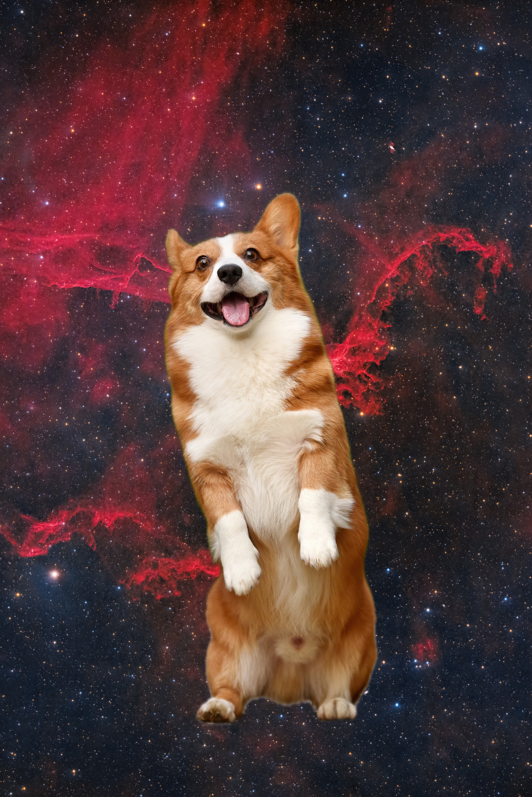 | 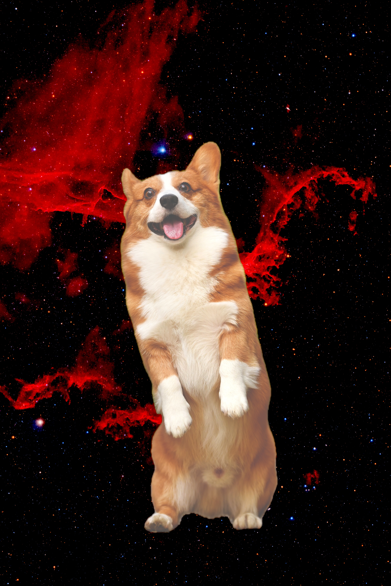 |

Three stages in one chain (`;` separators): background gets a moody darken + saturation boost so the nebula glows, foreground gets saturation + brightness lift to match the new lighting, then a golden 4-pixel outline rim-lights the subject against the deep colour. Independent layer scopes, left-to-right evaluation.

### Showcase image credits

All showcase fixtures are CC0 or Franz Enzenhofer's own CC BY 4.0 work. Sidecar JSONs travel with every fixture (`Tests/fixtures/showcase/*.json`).

| Fixture | Subject / artist | Licence | Source |
|---|---|---|---|
| `Red_Panda__24986761703_.jpg` | Mathias Appel | **CC0 / Public Domain** | [Wikimedia Commons](https://commons.wikimedia.org/wiki/File:Red_Panda_(24986761703).jpg) |
| `Fawn_and_white_Welsh_Corgi_puppy_...jpg` | Huoadg5888 (Pixabay) | **CC0 / Public Domain** | [Wikimedia Commons](https://commons.wikimedia.org/wiki/File:Fawn_and_white_Welsh_Corgi_puppy_standing_on_rear_legs_and_sticking_out_the_tongue.jpg) |
| `Parastoo_Ahmadi.jpg` | Wikimedia uploader | **CC0 / Public Domain** | [Wikimedia Commons](https://commons.wikimedia.org/wiki/File:Parastoo_Ahmadi.jpg) |
| `bg/Flying-Dragon-Nebula_Sh_2-113.png` | NASA / ESA Hubble (PD-USGov) | **CC0 / Public Domain** | [Wikimedia Commons](https://commons.wikimedia.org/wiki/File:Flying-Dragon-Nebula_Sh_2-113.png) |

Full per-filter docs in [`docs/filters/`](docs/filters/). The 49-filter catalogue index: [`docs/filters/README.md`](docs/filters/README.md).

## Capabilities

```bash
bgbgone --check
```

```
bgbgone v0.1.37 capability report
  OS:                  macOS 26.3.1
  Algorithms:
    vn-mask            available (foreground-instance mask, macOS 14+)
    person             available (Vision person segmentation, macOS 12+)
    saliency           available (Vision objectness saliency, macOS 10.15+)
  Output formats:      png, jpg, zip, heic, avif, tiff
  Backgrounds:
    color              always available
    image              always available
  Pipeline:
    network            hard-blocked at runtime
```

## All flags

```
USAGE:
  bgbgone [OPTIONS] [INPUT...]

DEFAULTS:
  bgbgone photo.jpg                       creates photo_bgbgone.png
  bgbgone photo.jpg > cutout.png          writes image bytes to stdout
  bgbgone photo.jpg -o cutout.jpg         infers JPEG; white bg by default

BACKGROUND:
  --bg color:<#hex|named|rgb:r,g,b>     solid colour
  --bg image:<path>                     image file
  --bg-fit cover|contain|tile|center    fit mode for image backgrounds

MATTE / EDGE:
  --channels rgba|alpha                 finalized image or alpha mask
  --crop                                tight-crop to subject bbox
  --crop-margin <1|2|4 px or %>         margins around the crop
  --roi "x1 y1 x2 y2"                   region of interest, px or %
  --filter fg:scale=F                   scale subject on the canvas (replaces removed --scale)
  --filter fg:translate=X,Y             place subject on canvas (replaces removed --position)
  --semitransparency true|false         keep or harden semi-transparent matte pixels
  --shadow-type auto|drop|3D|car|none   shadow preset (none = no shadow)
  --shadow-opacity <0..100|auto>        shadow darkness

ALGORITHM:
  --type auto|person|product|car|animal|graphic|transportation|saliency|vn-mask
                                        (default: auto)

MULTI-INSTANCE:
  --multi                               one file per detected instance (file input only)
  --instance-naming "{base}-{n}.{ext}"  filename template (supports {n:NN})

OUTPUT:
  --format png|jpg|zip|heic|avif|tiff
                                         output format (default: png)
  --size preview|full|50MP|auto         optional output megapixel cap
  --quality 1..100                      for lossy formats (default: 92)
  -o, --output <path>                   explicit output file
  --out-dir <dir>                       batch output directory

ROUTING RULES:
  -o and --out-dir are mutually exclusive
  stdin input requires stdout or -o; --out-dir needs file inputs
  --multi writes files; it cannot combine with -o

SERVER:
  --server                             run local HTTP API
  --host <addr>                        bind address (default: 127.0.0.1)
  --port <n>                           bind port (default: 8787)
  --cors                               enable CORS headers for allowed origins
  --allowed-origins <csv>              add allowed browser origins
  --no-origin-check | --footgun        disable browser origin checks
  --token <secret> | --token-auto      require Bearer token
  --public-health                      keep /health public on non-loopback binds
  --max-body-mb <n>                    request body limit (default: 32)

META:
  --json | --ndjson                     structured output
  --quiet | --verbose
  --version | --help | -h
  --check                               capability report

EXIT CODES:
  0  success
  1  user error (bad input, refusing TTY)
  2  parser error or no result
  3  framework error (Vision unavailable)
```

## Architecture

```
CLI args                    main.swift
   │
   ▼                        ConfigParser (pure Swift, no Apple framework deps, testable)
Config
   │
   ▼                        BgBgOne pipeline
   ├─→ ForegroundMask       Algorithms/: VNMask, Person, Saliency
   ├─→ MaskPostProcess      ROI, crop, padding (mask shape/edge via mask: filters and fg:matte)
   ├─→ Compositor           SolidColor + ImageBg
   └─→ Output               ImageIO: PNG/JPG/HEIC/AVIF/TIFF + ZIP package
HTTP server ───────────────→ same pipeline, multipart/JSON/form uploads, JSON/base64 option
                            NetworkGuard hard-blocks outbound http/https/ws/wss at runtime.
```

- `BgBgOneCore` library: pure Swift, no Vision dep, unit-testable.
- Main `bgbgone` target: Vision + Core Image integration.
- `bgbgone-tests`: pure-Swift test runner (no XCTest), same pattern as [apfel](https://github.com/Arthur-Ficial/apfel) and [auge](https://github.com/Arthur-Ficial/auge).

## Performance

```bash
make test-performance-100
```

100 fixture-backed inputs, five batch processes, 100 outputs verified per run. Release-gate performance is measured with:

```bash
bash Tests/performance/run-100.sh .build/release/bgbgone
```

Average over 5 release-binary runs: **100 images in 1.222 s, 81.84 images/s, 12.2 ms/image** with 95,487,542 output bytes verified per run. On-device, no network, no GPU contention with another process.

### Optional sustained-throughput tests (1k / 10k)

```bash
make test-performance-1000    # 10 x 100  = 1,000  image operations
make test-performance-10000   # 100 x 100 = 10,000 image operations
```

Both replay the same 100-image batch the release-gate exercises, but call the binary **N times in a row**. **Not part of `make release`** — opt-in. Models a heavy user who runs the same batch over and over throughout a day. Every invocation must produce identical output bytes (determinism check) and the matching README line below is re-written on every run, so repeated invocations always show the current measurement.

```bash
bash Tests/performance/run-sustained.sh .build/release/bgbgone 10    # 1k
bash Tests/performance/run-sustained.sh .build/release/bgbgone 100   # 10k
```

Average over 10 release-binary invocations of 100: **1000 image operations in 12.174 s, 82.14 images/s, 12.2 ms/image** with 95,487,542 output bytes verified per invocation. On-device, no network, no GPU contention with another process.

Average over 100 release-binary invocations of 100: **10000 image operations in 124.668 s, 80.21 images/s, 12.5 ms/image** with 95,487,542 output bytes verified per invocation. On-device, no network, no GPU contention with another process.

## Build & test

```bash
make install              # bump patch + build release + install to /usr/local/bin
make build                # bump patch + build release
make test                 # unit + integration
make test-unit            # Swift unit tests
make test-integration     # CLI e2e against strict-PD Wikimedia fixtures
make test-performance-100   # 100-image release-gate performance scenario
make test-performance-1000  # OPTIONAL 10 x 100  = 1,000  sustained ops
make test-performance-10000 # OPTIONAL 100 x 100 = 10,000 sustained ops
make fixtures             # fetch the test fixtures (one-time)
```

### Test fixtures

The integration tests run against [16 squarely-public-domain Wikimedia images](Tests/fixtures/LICENSES.md): NASA spaceflight imagery (PD-USGov), 19th-century paintings and woodblock prints (PD-old, PD-Art), 19th and early-20th-century studio portraits (PD-old), and pre-1929 American advertisements for Singer sewing machines, the Underwood typewriter, the Edison phonograph, and the Pierce-Arrow automobile (PD-1929). No Creative Commons. Full provenance per fixture in `Tests/fixtures/LICENSES.md`.

Every example image in this README is regenerated by `scripts/make-readme-examples.sh` against a freshly-installed binary on every release. The script is the audit trail for "every README image is real."

## Design

See [`docs/design.md`](docs/design.md) for the CLI surface, algorithm selection, exit-code policy, framework version gating, and the UNIX-style contract every capability is held to.

## Contributing

See [`DEVELOPMENT.md`](DEVELOPMENT.md) for the working agreement - hard rules, TDD procedure, UNIX checklist, performance budget, dependency policy, commit conventions, and release gate. Every commit on `main` is held to it.

## Privacy

- **No network.** `NetworkGuard.swift` registers a `URLProtocol` that intercepts any `http`, `https`, `ws`, or `wss` request inside the process and exits with code 3.
- **No telemetry.** No analytics, no crash reporting, no usage stats.
- **No API keys, no accounts, no subscriptions.**
- **Your images never leave your Mac.** Verifiable: run `bgbgone in.jpg` with Wi-Fi off.

## License

MIT. See [LICENSE](LICENSE).
