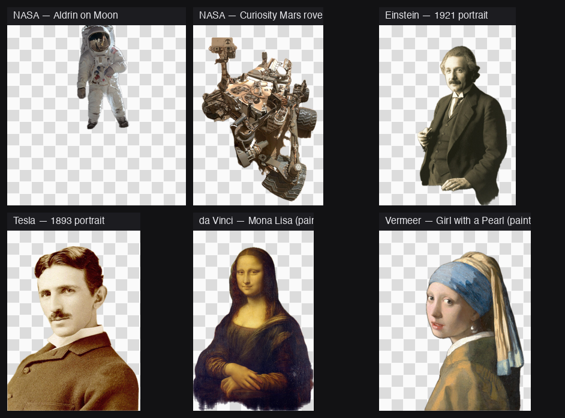

# bgbgone

[](https://github.com/Arthur-Ficial/bgbgone)
[](https://swift.org)
[](https://developer.apple.com/macos/)
[](LICENSE)
[](https://developer.apple.com/documentation/vision)

The ultimate UNIX-style background remover for macOS. AI-driven via Apple's on-device Vision framework and Image Playground. No API keys. No cloud. No network. No subscriptions. Pipe-friendly. Scriptable.


```bash
bgbgone in.jpg > out.png                          # transparent PNG cutout
bgbgone in.jpg --bg color:white -o on-white.png   # on a colour
bgbgone in.jpg --bg image:beach.jpg -o beach.png  # on an image
bgbgone in.jpg --bg gen:"sunset over mountains"   # on a generated background (Image Playground)
```

## Why

Every Mac in 2026 ships with a small render farm of on-device image AI. Apple's [Vision framework](https://developer.apple.com/documentation/vision) gives you `VNGenerateForegroundInstanceMaskRequest` — a foundation-model-class background remover, free, on every Mac, no internet required. But it's only callable from Swift. `bgbgone` wraps it as a UNIX CLI so you can use it from scripts, pipelines, batch jobs, build steps — anywhere you'd use `sips` or `imagemagick`.

It works on photos and paintings — anything with a subject:



## Install

**Homebrew** (recommended):

```bash
brew tap Arthur-Ficial/tap
brew install Arthur-Ficial/tap/bgbgone
```

**From source:**

```bash
git clone https://github.com/Arthur-Ficial/bgbgone.git
cd bgbgone
make install                  # builds + installs to /usr/local/bin
```

Requires macOS 26+ and Command Line Tools (`xcode-select --install`). No Xcode needed.

## Quick start

```bash
# zero-config — transparent PNG to stdout
bgbgone photo.jpg > cutout.png

# to a file
bgbgone photo.jpg -o cutout.png

# batch a whole folder
bgbgone ~/photos/*.heic --out-dir ./cutouts

# from a pipe
curl -L https://example.com/photo.jpg | bgbgone > cutout.png
cat photo.jpg | bgbgone --bg color:white > on-white.png
```

bgbgone refuses to write binary image bytes to a terminal — exactly like `curl`. Use `-o file`, `--out-dir dir`, or redirect to a file or pipe.

## Examples

### Just remove the background

The default: `bgbgone in.jpg` writes a transparent PNG to stdout. With `-o`, it writes to a file.


```bash
bgbgone einstein-1921.jpg -o einstein-cutout.png
```

### Replace with a colour

```bash
bgbgone product.jpg --bg color:white       -o catalogue.jpg --to jpg
bgbgone selfie.jpg  --bg color:#101a3a     -o passport.jpg --to jpg
bgbgone selfie.jpg  --bg color:rgb:0,200,0 -o greenscreen.png
```

### Replace with an image

```bash
bgbgone subject.jpg --bg image:./beach.jpg                       -o on-beach.png
bgbgone subject.jpg --bg image:./beach.jpg --bg-fit contain      -o letterboxed.png
bgbgone subject.jpg --bg image:./tile.png  --bg-fit tile         -o tiled.png
```

Six places Mona Lisa has never been — each panel is one CLI invocation:


### Replace with an AI-generated background

Uses Apple's on-device Image Playground (Apple Intelligence must be enabled in System Settings).

```bash
bgbgone subject.jpg --bg gen:"sunset over a desert"                       -o out.png
bgbgone subject.jpg --bg gen:"moody studio backdrop" --style illustration -o studio.png
bgbgone subject.jpg --bg gen:"$(apfel 'describe a peaceful background, vienna autumn')" -o autumn.png
```

### Output formats

```bash
bgbgone in.jpg --to png        # transparent (default)
bgbgone in.jpg --to jpg --bg color:white --quality 92
bgbgone in.jpg --to heic
bgbgone in.jpg --to tiff
bgbgone in.jpg --to webp       # if supported by your macOS ImageIO
bgbgone in.jpg --to avif       # if supported
```

### Edge refinement

```bash
bgbgone in.jpg --feather 4               # softer matte edges
bgbgone in.jpg --crop                    # tight-crop to subject bbox
bgbgone in.jpg --mask-only -o mask.png   # output just the alpha matte
```

Under the hood — input → grayscale matte → final transparent cutout:


Edge softening with `--feather` (close-up around the subject's outline):


### Multi-instance: one cutout per detected subject

```bash
bgbgone team-photo.jpg --multi --out-dir ./people/
# people/team-photo-1.png, people/team-photo-2.png, ...

bgbgone team.jpg --multi --instance-naming "subject_{n:02}.{ext}" --out-dir ./people/
# people/subject_01.png, people/subject_02.png, ...
```

### Algorithm selection

```bash
bgbgone in.jpg --algo auto       # picks best for your macOS (default)
bgbgone in.jpg --algo vn-remove  # VNRemoveBackgroundRequest (macOS 15+)
bgbgone in.jpg --algo vn-mask    # VNGenerateForegroundInstanceMaskRequest (macOS 14+)
bgbgone in.jpg --algo person     # CIPersonSegmentation
bgbgone in.jpg --algo sky        # CISkySegmentation (subject = sky)
bgbgone in.jpg --algo saliency   # attention saliency (fallback)
```

Same input, every `--algo`:


### Structured output (`--json`)

```bash
bgbgone in.jpg --json -o out.png
```

```json
{"input":"in.jpg","output":"out.png","algo":"vn-remove","format":"png","width":1280,"height":960}
```

NDJSON for streams:

```bash
ls *.jpg | xargs -I{} bgbgone {} --ndjson --out-dir ./out/ \
  | jq -s 'group_by(.algo) | map({algo: .[0].algo, n: length})'
```

### Real-world workflows

**Background removal makes downstream AI more accurate.** Pipe a cutout into [auge](https://github.com/Arthur-Ficial/auge) for cleaner classification:

```bash
$ auge --classify photo-with-busy-bg.jpg --top 3
67%  scene
21%  room
15%  furniture

$ bgbgone photo-with-busy-bg.jpg --bg color:black --to jpg -o /tmp/cut.jpg \
    && auge --classify /tmp/cut.jpg --top 3
71%  people
71%  adult
17%  helmet
```

**Catalogue a photo library on white background:**

```bash
for f in ~/products/*.heic; do
    bgbgone "$f" --bg color:white --to jpg --quality 92 \
        --out-dir ~/catalogue/ --json
done | jq -s 'group_by(.algo) | map({algo: .[0].algo, count: length})'
```

**Build a sticker pack from a group photo** (one PNG per detected person):

```bash
bgbgone team-portrait.jpg --multi \
    --instance-naming "{base}-sticker-{n:02}.{ext}" \
    --out-dir ./stickers/
```

**Generate a profile picture with a brand-coloured background:**

```bash
bgbgone selfie.jpg --bg color:#0066cc --crop --feather 2 \
    --to jpg --quality 95 -o linkedin-avatar.jpg
```

**Headless screenshot recipe** for a doc site (subject on white, exact dims):

```bash
bgbgone product.heic --bg color:white --feather 1 \
    --to jpg --quality 92 -o ./docs/product-shot.jpg
```

### Pipeline composition (with sibling tools)

bgbgone is part of the apfel ecosystem of on-device CLI tools:

| Tool                                              | What                        | Apple framework        |
| ------------------------------------------------- | --------------------------- | ---------------------- |
| [apfel](https://github.com/Arthur-Ficial/apfel)   | LLM (text generation)       | FoundationModels       |
| [auge](https://github.com/Arthur-Ficial/auge)     | Vision / OCR (see)          | Vision                 |
| **bgbgone** (this)                                | Background removal (do)     | Vision + ImagePlayground |
| [ohr](https://github.com/Arthur-Ficial/ohr)       | Speech-to-text              | SpeechAnalyzer         |
| [kern](https://github.com/Arthur-Ficial/kern)     | Embeddings                  | NLContextualEmbedding  |

They pipe together:

```bash
# bg-remove, then classify the cleaner cutout
bgbgone photo.jpg --bg color:black --to jpg -o /tmp/x.jpg && auge --classify /tmp/x.jpg

# bg-remove, then embed for similarity search
bgbgone photo.jpg --bg color:black --to jpg -o /tmp/x.jpg && kern --embed-image /tmp/x.jpg

# LLM-composed background prompt
bgbgone subject.jpg --bg gen:"$(apfel 'one-line description of a peaceful background')"

# Batch a folder, summarise what's in each cutout
for f in ~/photos/*.jpg; do
    bgbgone "$f" --bg color:black --to jpg -o /tmp/cut.jpg && auge --classify /tmp/cut.jpg --top 3
done
```

## Capabilities

```bash
bgbgone --check
```

```
bgbgone v0.0.11 capability report
  OS:                  macOS 26.3.1
  Algorithms:
    vn-remove          available
    vn-mask            available
    person             available (CIPersonSegmentation, macOS 12+)
    sky                available (CISkySegmentation, macOS 12+)
    saliency           available (Vision, macOS 10.15+)
  Backgrounds:
    color              always available
    image              always available
    gen (Image Playground)  available
  Pipeline:
    network            hard-blocked at runtime
```

## All flags

```
USAGE:
  bgbgone [OPTIONS] [INPUT...]

BACKGROUND:
  --bg color:<#hex|named|rgb:r,g,b>     solid colour
  --bg image:<path>                     image file
  --bg gen:<prompt>                     Image Playground generation
  --bg-fit cover|contain|tile|center    fit mode for image backgrounds
  --style auto|illustration|sketch|animation   Image Playground style

MATTE / EDGE:
  --mask-only                           output the alpha mask only
  --feather <px>                        edge softening (default: 1)
  --threshold <0..1>                    mask binarisation
  --padding <px|N%>                     extra space around subject
  --crop                                tight-crop to subject bbox
  --shadow                              drop shadow under cutout

ALGORITHM:
  --algo auto|vn-remove|vn-mask|person|sky|saliency   (default: auto)

MULTI-INSTANCE:
  --multi                               one file per detected instance
  --instance-naming "{base}-{n}.{ext}"  filename template (supports {n:NN})

OUTPUT:
  --to png|jpg|webp|heic|avif|tiff      output format (default: png)
  --quality 1..100                      for lossy formats (default: 92)
  -o, --output <path>                   explicit output file
  --out-dir <dir>                       batch output directory

META:
  --json | --ndjson                     structured output
  --quiet | --verbose
  --version | --help | -h
  --check                               capability report

EXIT CODES:
  0  success
  1  user error (bad input, refusing TTY)
  2  parser error or no result
  3  framework error (Vision / Image Playground unavailable)
```

## Architecture

```
CLI args                    main.swift
   │
   ▼                        ConfigParser (pure Swift, no Apple framework deps → testable)
Config
   │
   ▼                        BgBgOne pipeline
   ├─→ ForegroundMask       Algorithms/: VNRemove, VNMask, Person, Sky, Saliency
   ├─→ MaskPostProcess      feather, crop, --mask-only short-circuit
   ├─→ Compositor           Backgrounds/: SolidColor, ImageBg, GenerativeBg
   └─→ Output               ImageIO: PNG/JPG/WebP/HEIC/AVIF/TIFF
                            NetworkGuard hard-blocks http/https/ws/wss at runtime.
```

- `BgBgOneCore` library — pure Swift, no Vision dep, unit-testable.
- Main `bgbgone` target — Vision + Core Image + ImagePlayground integration.
- `bgbgone-tests` — pure-Swift test runner (no XCTest), same pattern as [apfel](https://github.com/Arthur-Ficial/apfel) and [auge](https://github.com/Arthur-Ficial/auge).

## Build & test

```bash
make install              # bump patch + build release + install to /usr/local/bin
make build                # bump patch + build release
make test                 # unit + integration
make test-unit            # Swift unit tests
make test-integration     # CLI e2e against strict-PD Wikimedia fixtures
make fixtures             # fetch the test fixtures (one-time)
```

### Tests

`make test` runs:

- **Unit tests** — argument parsing, colour parsing, instance-naming templating, network-scheme block list. 60+ cases, all in pure Swift (no XCTest).
- **Integration tests** — spawn the built binary and exercise every flag end-to-end across all 12 fixture images. 44+ cases.

### Test fixtures: strict public domain

The integration tests run against [12 squarely-public-domain Wikimedia images](Tests/fixtures/LICENSES.md) — PD-NASA federal-government work and PD-old by age (Hokusai, Vermeer, da Vinci, Schmutzer's Einstein, Sarony's Tesla, etc.). **No Creative Commons.** The full provenance and PD justification for every fixture is in `Tests/fixtures/LICENSES.md`.

## Design

See [`docs/design.md`](docs/design.md) for the design document — CLI surface, algorithm selection, exit-code policy, framework version gating, and the UNIX-style contract every capability is held to.

## Privacy

- **No network.** `NetworkGuard.swift` registers a `URLProtocol` that intercepts any `http`, `https`, `ws`, or `wss` request inside the process and exits with code 3. The Vision and Image Playground APIs we use are all on-device.
- **No telemetry.** No analytics, no crash reporting, no usage stats.
- **No API keys, no accounts, no subscriptions.**
- **Your images never leave your Mac.** Verifiable: try `bgbgone in.jpg` with the Wi-Fi off.

## License

MIT — see [LICENSE](LICENSE).
