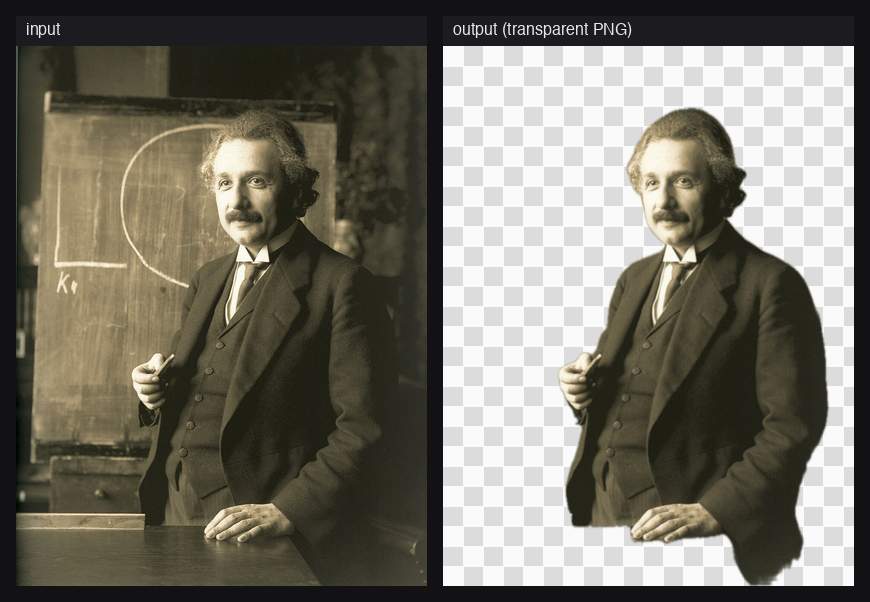
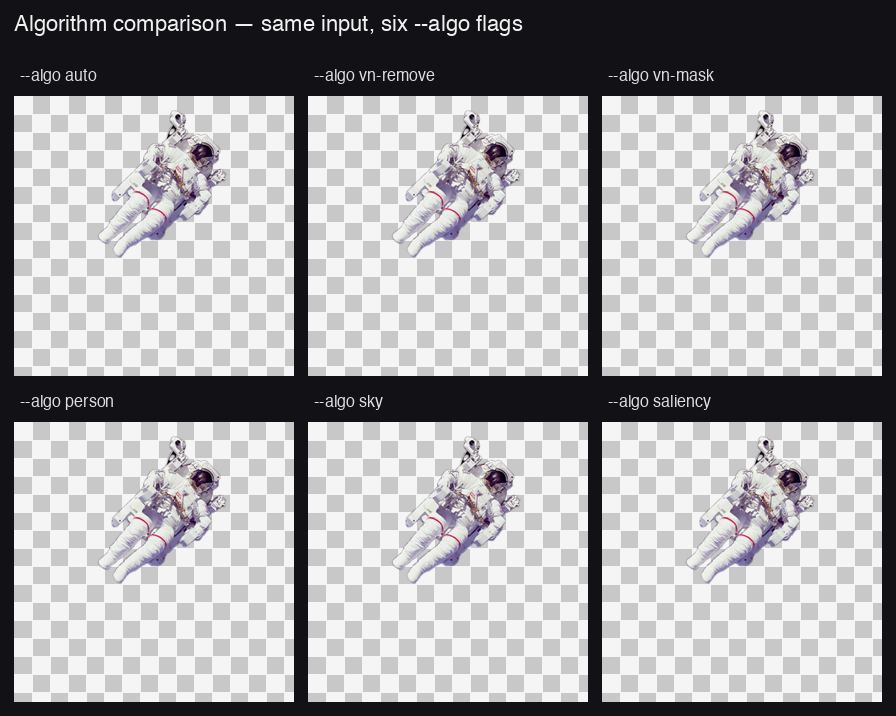

# bgbgone

[](https://github.com/Arthur-Ficial/bgbgone)
[](https://swift.org)
[](https://developer.apple.com/macos/)
[](LICENSE)
[](https://developer.apple.com/documentation/vision)
[](#why)

The ultimate UNIX-style background remover for macOS. AI-driven via Apple's on-device Vision framework. No API keys. No cloud. No network. No subscriptions. **No GUI side-effects ever** — pipe-friendly, scriptable, silent.


```bash
bgbgone in.jpg > out.png                          # transparent PNG cutout
bgbgone in.jpg --bg color:white -o on-white.png   # on a colour
bgbgone in.jpg --bg image:beach.jpg -o beach.png  # on an image
```

> **What about AI-generated backgrounds?** Apple's `ImageCreator` API
> (Image Playground) cannot be invoked from a UNIX CLI without launching a
> foreground `.app` that steals the menu bar — so `--bg gen:` was **removed in
> v0.1.2**. The honest workflow: generate the background once in any tool
> (Apple Image Playground, your favourite image model), save the file, and
> compose it with `--bg image:<file>`. See [docs/design.md](docs/design.md) for
> the full reasoning.

## Why

Every Mac in 2026 ships with a small render farm of on-device image AI. Apple's [Vision framework](https://developer.apple.com/documentation/vision) gives you `VNGenerateForegroundInstanceMaskRequest` — a foundation-model-class background remover, free, on every Mac, no internet required. But it's only callable from Swift. `bgbgone` wraps it as a UNIX CLI so you can use it from scripts, pipelines, batch jobs, build steps — anywhere you'd use `sips` or `imagemagick`.

It works on **anything with a foreground subject** — photos, paintings, lunar landscapes, spectroscopy, woodblock prints:


Every panel above is a real `bgbgone in.jpg > out.png` invocation against a documented public-domain Wikimedia image — same flag, sixteen very different subjects, no per-image tuning.

## Install

**Homebrew** (recommended):

```bash
brew tap Arthur-Ficial/tap
brew install Arthur-Ficial/tap/bgbgone
```

**From source:**

```bash
git clone https://github.com/Arthur-Ficial/bgbgone.git
cd bgbgone
make install                  # builds + installs to /usr/local/bin
```

Requires macOS 26+ and Command Line Tools (`xcode-select --install`). No Xcode needed.

## Quick start

```bash
# zero-config — transparent PNG to stdout
bgbgone photo.jpg > cutout.png

# to a file
bgbgone photo.jpg -o cutout.png

# batch a whole folder
bgbgone ~/photos/*.heic --out-dir ./cutouts

# from a pipe
curl -L https://example.com/photo.jpg | bgbgone > cutout.png
cat photo.jpg | bgbgone --bg color:white > on-white.png
```

bgbgone refuses to write binary image bytes to a terminal — exactly like `curl`. Use `-o file`, `--out-dir dir`, or redirect to a file or pipe.

---

## Examples (show, don't tell)

Every image below is a real bgbgone invocation against a [strict-PD Wikimedia fixture](Tests/fixtures/LICENSES.md). The command above each grid is the exact CLI used. Everything is reproducible with `bash scripts/make-readme-examples.sh`.

### 1) Just remove the background

The default: `bgbgone in.jpg` writes a transparent PNG to stdout. With `-o`, it writes to a file. Same input, same flag, sixteen subjects — works across photography, painting, spacecraft imagery, woodblock prints, and vintage product advertisements with no per-image tuning:

```bash
bgbgone in.jpg > out.png
bgbgone in.jpg -o out.png
```


A closer look at one subject — Einstein's 1921 studio portrait, source → transparent PNG:



### 2) Drop in a solid colour

One flag, any colour. Three different subjects, four colours each:

```bash
bgbgone in.jpg --bg color:white       -o out.png      # named colour
bgbgone in.jpg --bg color:black       -o out.png      # named colour
bgbgone in.jpg --bg color:#0066cc     -o out.png      # hex
bgbgone in.jpg --bg color:rgb:0,200,0 -o out.png      # rgb triple
```


Common knobs:

```bash
bgbgone product.jpg --bg color:white       -o catalogue.jpg --to jpg
bgbgone selfie.jpg  --bg color:#101a3a     -o passport.jpg --to jpg
bgbgone selfie.jpg  --bg color:rgb:0,200,0 -o greenscreen.png
```

### 3) Composite onto an image background

Pass any image as the background. The fit mode controls how it's placed:

```bash
bgbgone subject.jpg --bg image:./bg.jpg                   -o out.png
bgbgone subject.jpg --bg image:./bg.jpg --bg-fit cover    -o cover.png     # default
bgbgone subject.jpg --bg image:./bg.jpg --bg-fit contain  -o contain.png
bgbgone subject.jpg --bg image:./bg.jpg --bg-fit tile     -o tiled.png
bgbgone subject.jpg --bg image:./bg.jpg --bg-fit center   -o center.png
```

Row 1: same subject (Einstein) on Earthrise, every `--bg-fit` mode side by side.
Row 2: same subject (astronaut EVA) on two different PD backgrounds (Hubble nebula, Hokusai wave):


Same subject (Mona Lisa), seven different backgrounds — every one is a verifiable PD fixture (the eighth panel is the workflow tip for using outputs from any other tool, including Apple's standalone Image Playground app):


```bash
bgbgone mona-lisa.jpg --bg color:white                                    -o studio.jpg
bgbgone mona-lisa.jpg --bg color:black                                    -o dark.jpg
bgbgone mona-lisa.jpg --bg image:./hubble-ngc1300.jpg                     -o galaxy.jpg
bgbgone mona-lisa.jpg --bg image:./nasa-aldrin-moon.jpg                   -o moon.jpg
bgbgone mona-lisa.jpg --bg image:./hokusai-great-wave.jpg                 -o wave.jpg
bgbgone mona-lisa.jpg --bg image:./mars-curiosity.jpg                     -o mars.jpg
```

### 4) Edge refinement — feather, crop, padding, shadow, mask-only

`--feather <px>` softens the matte edge. Effect is visible at 0/1/4/8/16 px on the same subject:


```bash
bgbgone in.jpg --bg color:white --feather 0    -o hard.png
bgbgone in.jpg --bg color:white --feather 4    -o soft.png
bgbgone in.jpg --bg color:white --feather 16   -o very-soft.png

bgbgone in.jpg --crop                          -o tight.png
bgbgone in.jpg --crop --padding 10%            -o tight-with-margin.png
bgbgone in.jpg --bg color:white --shadow       -o with-shadow.png
bgbgone in.jpg --mask-only                     -o matte.png
```

A closer look at the matte itself — `--mask-only` emits the grayscale alpha, which the compositor then uses to blend the subject:


And a pixel-level zoom on the actual edge for `--feather 0` vs `--feather 8`:


### 5) Algorithm selection (`--algo`)

bgbgone exposes the five Vision / Core Image segmentation primitives directly. `auto` picks the best available for your macOS version. Same input, every algorithm, three different subjects:

```bash
bgbgone in.jpg --algo auto       # picks best (default)
bgbgone in.jpg --algo vn-remove  # VNRemoveBackgroundRequest (macOS 15.1+)
bgbgone in.jpg --algo vn-mask    # VNGenerateForegroundInstanceMaskRequest (macOS 14+)
bgbgone in.jpg --algo person     # CIPersonSegmentation
bgbgone in.jpg --algo sky        # CISkySegmentation (subject = sky)
bgbgone in.jpg --algo saliency   # attention saliency (fallback)
```


A single isolated subject (untethered astronaut) where every algorithm has plenty to lock onto:



### 6) Output formats

bgbgone writes any format ImageIO supports on your macOS:

```bash
bgbgone in.jpg --to png                              # transparent (default)
bgbgone in.jpg --to jpg --bg color:white --quality 92
bgbgone in.jpg --to heic
bgbgone in.jpg --to tiff
bgbgone in.jpg --to webp                             # if supported by your macOS ImageIO
bgbgone in.jpg --to avif                             # if supported
```

### 7) Multi-instance (`--multi`)

```bash
bgbgone team-photo.jpg --multi --out-dir ./people/
# people/team-photo-1.png, people/team-photo-2.png, ...

bgbgone team.jpg --multi --instance-naming "subject_{n:02}.{ext}" --out-dir ./people/
# people/subject_01.png, people/subject_02.png, ...
```

Each detected instance is written as its own file using `--instance-naming`. The number of instances is decided by Vision — for **tightly-grouped or touching subjects** (every PD-fixture group photo we tested: Apollo 11 crew, Wright Brothers) Vision returns one combined instance. For subjects with visible spatial gaps you'll get one file per subject.

### 8) Structured output (`--json`, `--ndjson`)

```bash
bgbgone in.jpg --json -o out.png
```

```json
{"input":"in.jpg","output":"out.png","algo":"vn-remove","format":"png","width":1280,"height":960}
```

NDJSON for streams:

```bash
ls *.jpg | xargs -I{} bgbgone {} --ndjson --out-dir ./out/ \
  | jq -s 'group_by(.algo) | map({algo: .[0].algo, n: length})'
```

### 9) Pipe into downstream AI

A clean cutout makes downstream classifiers, embedders, and OCR much more accurate. With [auge](https://github.com/Arthur-Ficial/auge):


The fourth panel shows the **actual** `auge --classify` output on the curiosity-rover cutout — not a fabricated label. Reproducible:

```bash
bgbgone Tests/fixtures/06-nasa-mars-curiosity-selfie.jpg \
    --bg color:black --to jpg -o /tmp/cut.jpg
auge --classify /tmp/cut.jpg --top 5
# machine: 52%
# toy: 12%
# figurine: 12%
# art: 10%
# statue: 10%
```

### 10) Product photography — every step, then re-cast into a hilarious new context

Vintage public-domain ads make great product-cutout demos. For each item, here's the full pipeline: source → `--mask-only` alpha matte → transparent cutout → recomposed onto a wildly out-of-context PD background. Every panel is a real bgbgone invocation:


```bash
# Row 1 — Underwood Standard Typewriter (PSM 1909) now writes on the Moon
bgbgone underwood-1909.jpg --mask-only                       -o matte.png
bgbgone underwood-1909.jpg                                   -o cutout.png
bgbgone underwood-1909.jpg --bg image:nasa-aldrin-moon.jpg   -o lunar-typewriter.png

# Row 2 — Edison + phonograph (c.1877) now spinning records in the Hubble nebula
bgbgone edison-phonograph.jpg --mask-only                    -o matte.png
bgbgone edison-phonograph.jpg                                -o cutout.png
bgbgone edison-phonograph.jpg --bg image:hubble-ngc1300.jpg  -o galactic-dj.png

# Row 3 — Singer "All Nations" poster (1892) now also surfs
bgbgone singer-1892.jpg --mask-only                          -o matte.png
bgbgone singer-1892.jpg                                      -o cutout.png
bgbgone singer-1892.jpg --bg image:hokusai-great-wave.jpg    -o singer-surfs.png

# Row 4 — Winchester rifle ad (1909) now hunting on Mars
bgbgone winchester-1909.jpg --mask-only                      -o matte.png
bgbgone winchester-1909.jpg                                  -o cutout.png
bgbgone winchester-1909.jpg --bg image:mars-curiosity.jpg    -o mars-hunter.png
```

Useful in production: drop the absurd-context lines, use `--bg color:white` instead, and you have an instant white-bg catalogue pipeline for any product photo.

### 11) Real-world recipes

**Catalogue a photo library on white background:**

```bash
for f in ~/products/*.heic; do
    bgbgone "$f" --bg color:white --to jpg --quality 92 \
        --out-dir ~/catalogue/ --json
done | jq -s 'group_by(.algo) | map({algo: .[0].algo, count: length})'
```

**Generate a profile picture with a brand-coloured background:**

```bash
bgbgone selfie.jpg --bg color:#0066cc --crop --feather 2 \
    --to jpg --quality 95 -o linkedin-avatar.jpg
```

**Sticker pack from a group photo** (one PNG per detected instance):

```bash
bgbgone team-portrait.jpg --multi \
    --instance-naming "{base}-sticker-{n:02}.{ext}" \
    --out-dir ./stickers/
```

**Headless screenshot recipe** for a doc site (subject on white, tight crop, soft edge):

```bash
bgbgone product.heic --bg color:white --crop --feather 1 \
    --to jpg --quality 92 -o ./docs/product-shot.jpg
```

**Pipeline composition with sibling tools:**

```bash
# bg-remove, then classify the cleaner cutout
bgbgone photo.jpg --bg color:black --to jpg -o /tmp/x.jpg && auge --classify /tmp/x.jpg

# bg-remove, then embed for similarity search
bgbgone photo.jpg --bg color:black --to jpg -o /tmp/x.jpg && kern --embed-image /tmp/x.jpg
```

bgbgone is part of the apfel ecosystem of on-device CLI tools:

| Tool                                              | What                        | Apple framework        |
| ------------------------------------------------- | --------------------------- | ---------------------- |
| [apfel](https://github.com/Arthur-Ficial/apfel)   | LLM (text generation)       | FoundationModels       |
| [auge](https://github.com/Arthur-Ficial/auge)     | Vision / OCR (see)          | Vision                 |
| **bgbgone** (this)                                | Background removal (do)     | Vision masks + Core Image |
| [ohr](https://github.com/Arthur-Ficial/ohr)       | Speech-to-text              | SpeechAnalyzer         |
| [kern](https://github.com/Arthur-Ficial/kern)     | Embeddings                  | NLContextualEmbedding  |

## Capabilities

```bash
bgbgone --check
```

```
bgbgone v0.1.8 capability report
  OS:                  macOS 26.3.1
  Algorithms:
    vn-remove          available
    vn-mask            available
    person             available (CIPersonSegmentation, macOS 12+)
    sky                available (CISkySegmentation, macOS 12+)
    saliency           available (Vision, macOS 10.15+)
  Backgrounds:
    color              always available
    image              always available
  Pipeline:
    network            hard-blocked at runtime
```

## All flags

```
USAGE:
  bgbgone [OPTIONS] [INPUT...]

BACKGROUND:
  --bg color:<#hex|named|rgb:r,g,b>     solid colour
  --bg image:<path>                     image file
  --bg-fit cover|contain|tile|center    fit mode for image backgrounds

MATTE / EDGE:
  --mask-only                           output the alpha mask only
  --feather <px>                        edge softening (default: 1)
  --threshold <0..1>                    mask binarisation
  --padding <px|N%>                     extra space around subject
  --crop                                tight-crop to subject bbox
  --shadow                              drop shadow under cutout

ALGORITHM:
  --algo auto|vn-remove|vn-mask|person|sky|saliency   (default: auto)

MULTI-INSTANCE:
  --multi                               one file per detected instance
  --instance-naming "{base}-{n}.{ext}"  filename template (supports {n:NN})

OUTPUT:
  --to png|jpg|webp|heic|avif|tiff      output format (default: png)
  --quality 1..100                      for lossy formats (default: 92)
  -o, --output <path>                   explicit output file
  --out-dir <dir>                       batch output directory

META:
  --json | --ndjson                     structured output
  --quiet | --verbose
  --version | --help | -h
  --check                               capability report

EXIT CODES:
  0  success
  1  user error (bad input, refusing TTY)
  2  parser error or no result
  3  framework error (Vision unavailable)
```

## Architecture

```
CLI args                    main.swift
   │
   ▼                        ConfigParser (pure Swift, no Apple framework deps → testable)
Config
   │
   ▼                        BgBgOne pipeline
   ├─→ ForegroundMask       Algorithms/: VNRemove, VNMask, Person, Sky, Saliency
   ├─→ MaskPostProcess      feather, crop, --mask-only short-circuit
   ├─→ Compositor           SolidColor + ImageBg
   └─→ Output               ImageIO: PNG/JPG/WebP/HEIC/AVIF/TIFF
                            NetworkGuard hard-blocks http/https/ws/wss at runtime.
```

- `BgBgOneCore` library — pure Swift, no Vision dep, unit-testable.
- Main `bgbgone` target — Vision + Core Image integration.
- `bgbgone-tests` — pure-Swift test runner (no XCTest), same pattern as [apfel](https://github.com/Arthur-Ficial/apfel) and [auge](https://github.com/Arthur-Ficial/auge).

## Build & test

```bash
make install              # bump patch + build release + install to /usr/local/bin
make build                # bump patch + build release
make test                 # unit + integration
make test-unit            # Swift unit tests
make test-integration     # CLI e2e against strict-PD Wikimedia fixtures
make fixtures             # fetch the test fixtures (one-time)
```

### Tests

`make test` runs:

- **Unit tests** — argument parsing, colour parsing, instance-naming templating, network-scheme block list. 60 cases, all in pure Swift (no XCTest).
- **Integration tests** — spawn the built binary and exercise every flag end-to-end across all 16 fixture images. 48 cases.

### Test fixtures: strict public domain

The integration tests run against [16 squarely-public-domain Wikimedia images](Tests/fixtures/LICENSES.md) — PD-NASA federal-government work, PD-old by age (Hokusai, Vermeer, da Vinci, Schmutzer's Einstein, Sarony's Tesla, etc.), and pre-1929 American advertisements (Singer, Underwood, Edison + phonograph, Winchester). **No Creative Commons.** The full provenance and PD justification for every fixture is in `Tests/fixtures/LICENSES.md`.

Every example image in this README was generated by `scripts/make-readme-examples.sh` — re-runnable, so claims are reproducible.

## Design

See [`docs/design.md`](docs/design.md) for the design document — CLI surface, algorithm selection, exit-code policy, framework version gating, and the UNIX-style contract every capability is held to.

## Removed in v0.1.2

- **`--bg gen:<prompt>` (Apple Image Playground).** Apple's `ImageCreator` API throws `backgroundCreationForbidden` for any process not launched as a foreground `.app`. The only workaround is to wrap bgbgone in a temporary `.app` and `open --args`, which steals the menu bar from the user's frontmost app and is therefore incompatible with the 100%-scriptable goal. See [docs/design.md](docs/design.md) and [CLAUDE.md](CLAUDE.md) for the full reasoning. If you need a generated background, save the generator's output to disk and use `--bg image:<path>`.
- **`--style` flag.** Only meaningful in combination with `--bg gen:`, removed alongside it.

## Privacy

- **No network.** `NetworkGuard.swift` registers a `URLProtocol` that intercepts any `http`, `https`, `ws`, or `wss` request inside the process and exits with code 3. The Vision APIs we use are all on-device.
- **No telemetry.** No analytics, no crash reporting, no usage stats.
- **No API keys, no accounts, no subscriptions.**
- **Your images never leave your Mac.** Verifiable: try `bgbgone in.jpg` with the Wi-Fi off.

## License

MIT — see [LICENSE](LICENSE).
