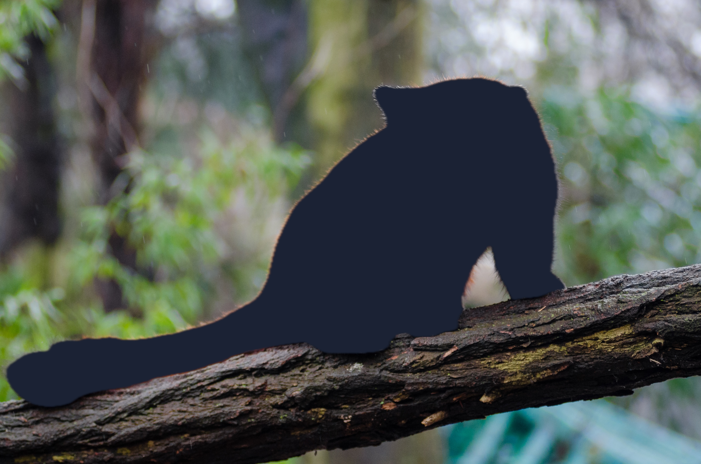

# `cutout`

> subject becomes a hole; background stays

| Field | Value |
|---|---|
| **Layers** | fg |
| **Signature** | `cutout` |
| **Note** | introduces alpha — use PNG output or pass `--bg` |

## Example — red-panda

Original input:


```bash
bgbgone red-panda.jpg --bg "image:red-panda.jpg" --filter "fg:cutout" -o red-panda-cutout.jpg
```

After `fg:cutout`:




## Per-layer panels — yoga (`--type person`)

Original input:


```bash
bgbgone yoga.jpg --type person --bg color:#1a2233 --filter "fg:cutout"
```

Panels (`original | bg | fg | all`):


## Per-layer panels — woman-singer (`--type person`)

Original input:


```bash
bgbgone woman-singer.jpg --type person --bg color:#1a2233 --filter "fg:cutout"
```

Panels (`original | bg | fg | all`):


See the [filter index](README.md) for the full catalogue.
