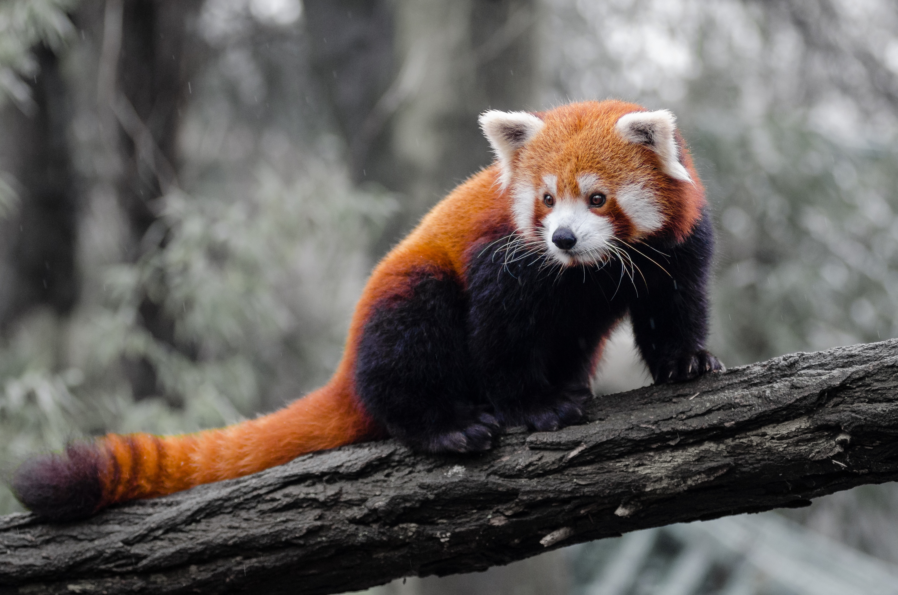

# `desaturate`

> Partial desaturation - 0 keeps colour, 1 equals grayscale.

| Field | Value |
|---|---|
| **Category** | tone+colour |
| **Valid layers** | fg / bg / all |
| **Signature** | `desaturate=amount` |
| **Backed by** | CIColorControls inputSaturation=1-amount |

## Example

```bash
bgbgone red-panda.jpg --bg "image:red-panda.jpg" --filter "bg:desaturate=0.8"
```

| Baseline | After `bg:desaturate=0.8` |
|---|---|
|  |  |

Asset regenerated by [`scripts/make-filter-showcase.sh`](../../scripts/make-filter-showcase.sh) against the [Red Panda fixture (CC0)](../../Tests/fixtures/showcase/Red_Panda__24986761703_.jpg). Run `bash scripts/make-filter-showcase.sh` after every implementation change to refresh.

## See also

- Filter index: [docs/filters/README.md](README.md)
- Composition rules: [composition.md](composition.md)
- Curated chains: [recipes.md](recipes.md)
- Grammar primer: `bgbgone --help` / `bgbgone --filters-list`
