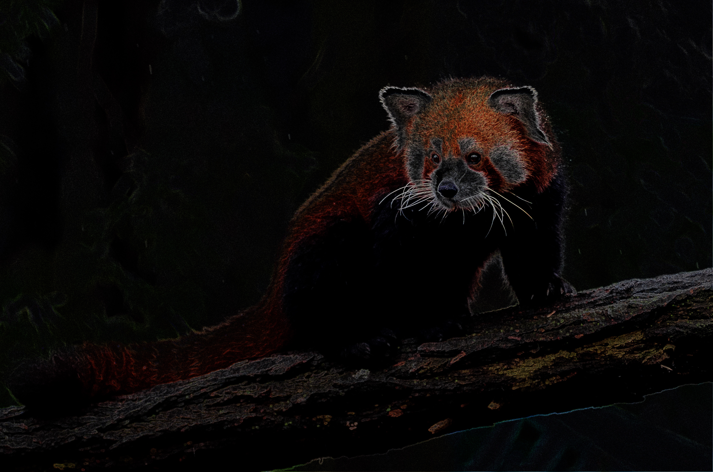

# `edges`

> edge detection (CIEdges)

| Field | Value |
|---|---|
| **Layers** | all, bg, fg |
| **Signature** | `edges=intensity` |


## Example — red-panda

Original input:


```bash
bgbgone red-panda.jpg --bg "image:red-panda.jpg" --filter "all:edges=2.5" -o red-panda-edges.jpg
```

After `all:edges=2.5`:




## Per-layer panels — yoga (`--type person`)

Original input:


```bash
bgbgone yoga.jpg --type person --bg "image:yoga.jpg" --filter "all:edges"
bgbgone yoga.jpg --type person --bg "image:yoga.jpg" --filter "bg:edges"
bgbgone yoga.jpg --type person --bg color:#1a2233 --filter "fg:edges"
```

Panels (`original | bg | fg | all`):


## Per-layer panels — woman-singer (`--type person`)

Original input:


```bash
bgbgone woman-singer.jpg --type person --bg "image:woman-singer.jpg" --filter "all:edges"
bgbgone woman-singer.jpg --type person --bg "image:woman-singer.jpg" --filter "bg:edges"
bgbgone woman-singer.jpg --type person --bg color:#1a2233 --filter "fg:edges"
```

Panels (`original | bg | fg | all`):


See the [filter index](README.md) for the full catalogue.
