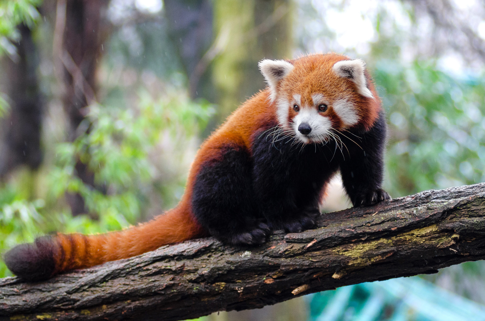

# `exposure`

> +/- stops, typical -2..+2 (CIExposureAdjust)

| Field | Value |
|---|---|
| **Layers** | all, bg, fg |
| **Signature** | `exposure=stops` |


## Example — red-panda

Original input:


```bash
bgbgone red-panda.jpg --bg "image:red-panda.jpg" --filter "all:exposure=1.0" -o red-panda-exposure.jpg
```

After `all:exposure=1.0`:




## Per-layer panels — yoga (`--type person`)

```bash
bgbgone yoga.jpg --type person --bg "image:yoga.jpg" --filter "all:exposure"
bgbgone yoga.jpg --type person --bg "image:yoga.jpg" --filter "bg:exposure"
bgbgone yoga.jpg --type person --bg color:#1a2233 --filter "fg:exposure"
```

Panels (`original | bg | fg | all`):


## Per-layer panels — woman-singer (`--type person`)

```bash
bgbgone woman-singer.jpg --type person --bg "image:woman-singer.jpg" --filter "all:exposure"
bgbgone woman-singer.jpg --type person --bg "image:woman-singer.jpg" --filter "bg:exposure"
bgbgone woman-singer.jpg --type person --bg color:#1a2233 --filter "fg:exposure"
```

Panels (`original | bg | fg | all`):


See the [filter index](README.md) for the full catalogue.
