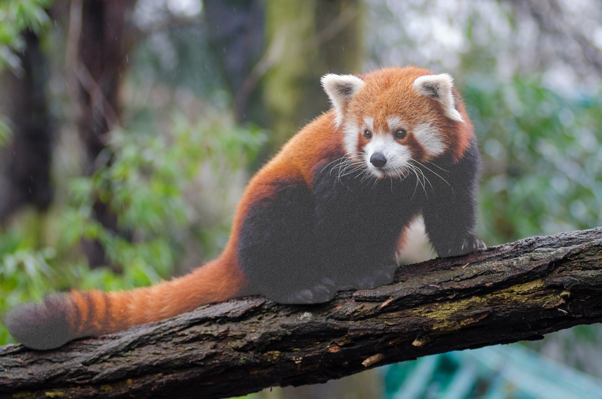
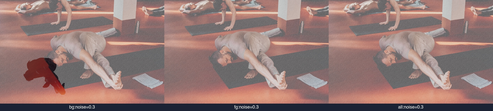
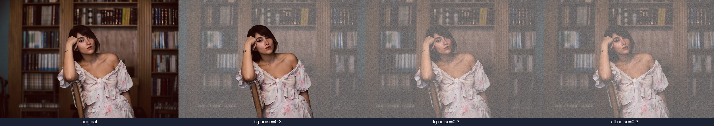

# `noise`

> Additive film grain.

| Field | Value |
|---|---|
| **Category** | stylise |
| **Valid layers** | fg / bg / all |
| **Signature** | `noise=amount` |
| **Backed by** | CIRandomGenerator + CISourceOverCompositing |

## Example

```bash
bgbgone red-panda.jpg --bg "image:red-panda.jpg" --filter "all:noise=0.3"
```

| Baseline | After `all:noise=0.3` |
|---|---|
|  |  |

Asset regenerated by [`scripts/make-filter-showcase.sh`](../../scripts/make-filter-showcase.sh) against the [Red Panda fixture (CC0)](../../Tests/fixtures/showcase/Red_Panda__24986761703_.jpg).

## Layer comparison — yoga (`--type person`)

Same filter on the valid layer(s), subject isolated via Apple Vision's person-segmentation model so neighbouring yogis don't interfere.

```bash
bgbgone yoga.jpg --type person --filter "bg:noise"
bgbgone yoga.jpg --type person --filter "fg:noise"
bgbgone yoga.jpg --type person --filter "all:noise"
```



## Layer comparison — Parastoo Ahmadi (`--type person`)

Same chain against the [Parastoo Ahmadi portrait (CC0, Wikimedia Commons)](https://commons.wikimedia.org/wiki/File:Parastoo_Ahmadi.jpg) — different lighting, different background detail, same per-layer behaviour.



Panels regenerated by [`scripts/make-perfilter-panels.sh`](../../scripts/make-perfilter-panels.sh) on every release.

## See also

- Filter index: [docs/filters/README.md](README.md)
- Composition rules: [composition.md](composition.md)
- Curated chains: [recipes.md](recipes.md)
- Grammar primer: `bgbgone --help` / `bgbgone --filters-list`
